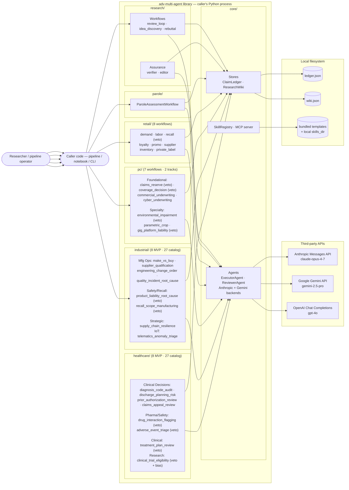
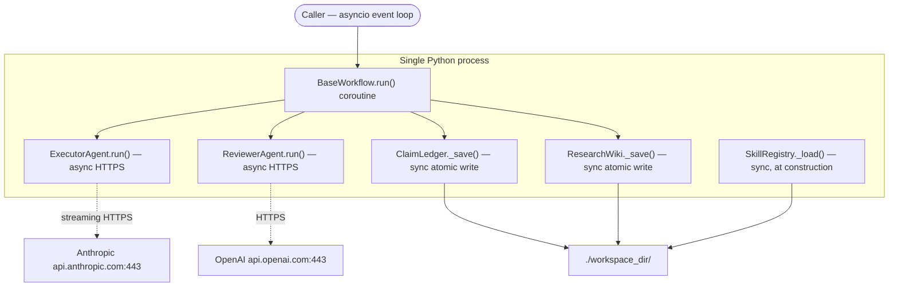
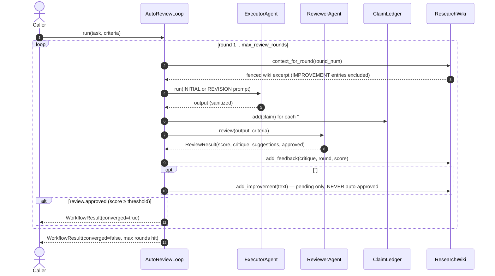
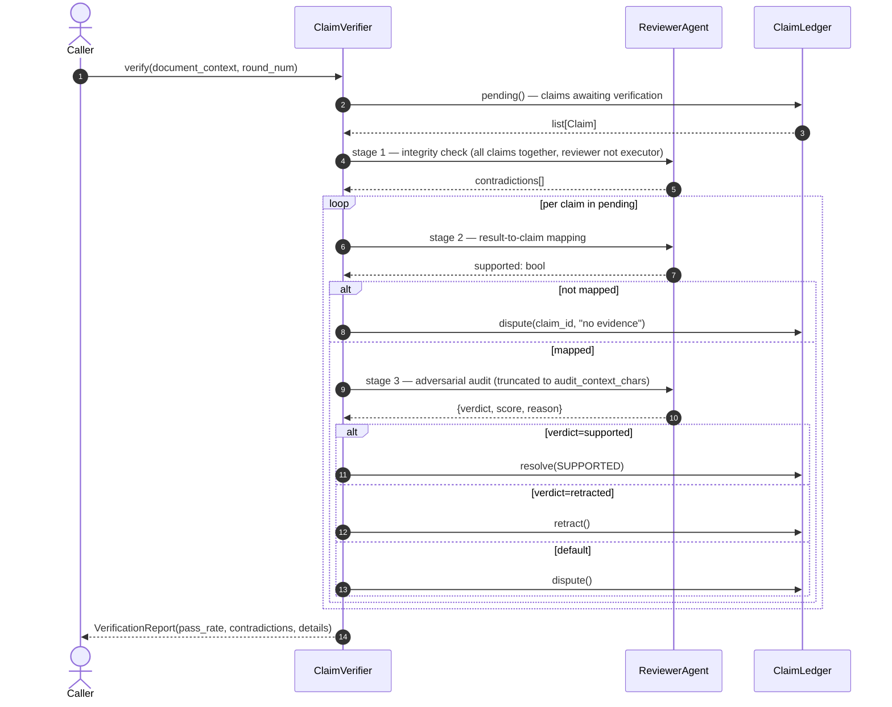
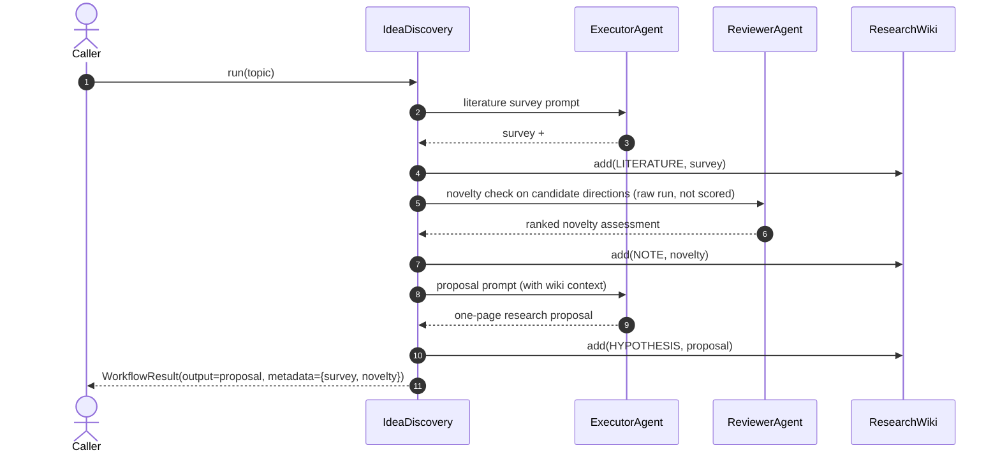
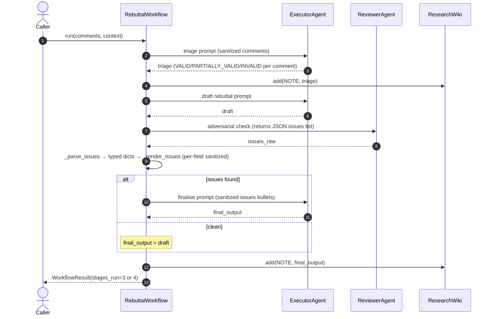

# Architecture

Internal compass. Not for external readers — keep it dense and link, don't restate. Authoritative source-of-truth pointers:

- Locked decisions (models, async, persistence, convergence): [`decisions.md`](decisions.md).
- Build phasing and dependencies: [`build-plan.md`](build-plan.md).
- Working conventions: [`../CLAUDE.md`](../CLAUDE.md).
- Threat model and post-fix enforcement: [`SECURITY_MODEL.md`](SECURITY_MODEL.md).
- Per-component retro-specs: [`superpowers/specs/`](superpowers/specs).

This document covers what those don't: _why the pieces fit together this way_, what flows look like end-to-end, where the scaling limits sit, and the open architectural risks.

---

## 0. V0 vs V1 — what's active when

The library has two activation modes. Every section below applies to both unless otherwise marked.

| Concern | V0 (current — library) | V1 (potential — hosted) |
|---|---|---|
| Distribution | `pip install adv-multi-agent` | MCP server image + cloud deployment |
| Process model | Caller's Python process | Multi-tenant server with per-session sandboxes |
| Persistence | Local JSON (`ledger.json`, `wiki.json`) via atomic writes | Postgres / SQLite per workspace |
| Concurrency | Single-process; document the limit | File-locked or DB-backed; multi-process safe |
| Skills | **148 bundled templates** (15 research + 6 parole + 34 retail + 29 pc + 32 industrial + 32 healthcare) inside the wheel; local override via `Config(skills_dir=...)` | Versioned, signed, distributed via the registry |
| Executor surface | Anthropic API direct | Anthropic + Bedrock + Vertex (per decision matrix in [decisions.md](decisions.md)) |
| Observability | Caller wires their own logging | Built-in audit log + OpenTelemetry exporter |
| Self-improvement adoption | Pending-only; caller approves out of band | Same, but approval is an authenticated UI action |

**V1 switch-on trigger:** first material multi-user research collaboration request, OR sustained external research-pipeline integration ask (>3 distinct teams in 90 days). V1 critical path is ~4–6 weeks (MCP wrapper 1–2 weeks, persistence backend 1–2 weeks, distribution + signing 1 week, telemetry 1 week).

---

## 1. System context

The library is a thin Python package over two external APIs and the local filesystem. No microservices, no queue, no caching, no daemon. The caller's process is the deployment boundary.

---

## 2. Components and ownership

| Component | Responsibility | Boundary |
|---|---|---|
| **`ExecutorAgent`** | Thin facade over `_AnthropicExecutor` / `_GeminiExecutor`. Drives work forward — generates, revises. Sole owner of Anthropic/Gemini client config. | [`core/agents.py`](../src/adv_multi_agent/core/agents.py) |
| **`ReviewerAgent`** | Cross-model adversarial review (GPT-4o default; secondary Anthropic fallback). Returns structured `ReviewResult` with score-clamped output. | [`core/agents.py`](../src/adv_multi_agent/core/agents.py) |
| **`_GeminiExecutor`** | Gemini 2.5 Pro backend; `thinking_budget` mapped from `EffortLevel`. Lazy-imported — requires `[gemini]` extra. | [`core/agents.py`](../src/adv_multi_agent/core/agents.py) |
| **`ClaimLedger`** | Append-only claim store with 3-state lifecycle (PENDING → SUPPORTED/DISPUTED/RETRACTED). Atomic persistence. | [`core/ledger.py`](../src/adv_multi_agent/core/ledger.py) |
| **`ResearchWiki`** | Persistent shared knowledge across runs. Fence-wrapped prompt injection prevention. Self-improvement proposals stored pending-only. | [`core/wiki.py`](../src/adv_multi_agent/core/wiki.py) |
| **`SkillRegistry`** | Discovers and loads `*.md` skill templates with frontmatter validation, name regex, size caps. `bundled_skills_path(domain=)` resolves packaged templates. | [`core/skills/registry.py`](../src/adv_multi_agent/core/skills/registry.py) |
| **`MCP server`** | FastMCP server exposing 4 tools (`list_skills`, `describe_skills`, `get_skill`, `render_skill`). `SKILLS_DOMAIN` env selects domain. | [`core/skills/mcp_server.py`](../src/adv_multi_agent/core/skills/mcp_server.py) |
| **`AutoReviewLoop`** | Adversarial executor↔reviewer loop with dual convergence (score threshold OR max rounds). | [`research/workflows/review_loop.py`](../src/adv_multi_agent/research/workflows/review_loop.py) |
| **`IdeaDiscovery`** | Three-phase: literature survey → novelty check → proposal. | [`research/workflows/idea_discovery.py`](../src/adv_multi_agent/research/workflows/idea_discovery.py) |
| **`RebuttalWorkflow`** | Four-stage rebuttal: triage → draft → adversarial check → finalise. | [`research/workflows/rebuttal.py`](../src/adv_multi_agent/research/workflows/rebuttal.py) |
| **`ClaimVerifier`** | 3-stage assurance: integrity → result-mapping → adversarial audit. All stages use the reviewer (cross-model). | [`research/assurance/verifier.py`](../src/adv_multi_agent/research/assurance/verifier.py) |
| **`ScientificEditor`** | 5-pass editing pipeline + reviewer spot-check. Input size guarded. | [`research/assurance/editor.py`](../src/adv_multi_agent/research/assurance/editor.py) |
| **`ParoleAssessmentWorkflow`** | Parole decision-support workflow; dual-mandate reviewer (quality + bias gate); advisory brief with mandatory disclaimer. | [`parole/workflows/parole.py`](../src/adv_multi_agent/parole/workflows/parole.py) |
| **`retail/` (8 workflows)** | demand, labor, recall (veto + scope/evidence/regulatory triple-flag), loyalty, promo, supplier, inventory, private_label. Each with domain-specific FLAGS convergence gate; advisory output with approver checklist. | [`retail/workflows/*.py`](../src/adv_multi_agent/retail/workflows/) |
| **`pc/` (7 workflows · Foundational + Specialty)** | Foundational: `ClaimsReserveWorkflow` (veto + triple-flag) · `CoverageDecisionWorkflow` (veto + dual-flag) · `CommercialUnderwritingWorkflow` (triple-flag) · `CyberUnderwritingWorkflow` (triple-flag). Specialty (D-PC-6): `EnvironmentalImpairmentWorkflow` (veto + triple-flag) · `ParametricCropWorkflow` (triple-flag) · `GigPlatformLiabilityWorkflow` (veto + triple-flag). 29 skill templates. | [`pc/workflows/*.py`](../src/adv_multi_agent/pc/workflows/) |
| **`industrial/` (8 MVP of 27-workflow catalog)** | Manufacturing Ops: `MakeVsBuyWorkflow` · `SupplierQualificationWorkflow` · `EngineeringChangeOrderWorkflow` · `QualityIncidentRootCauseWorkflow`. Safety / Recall: `ProductLiabilityRootCauseWorkflow` (veto + triple-flag) · `RecallScopeManufacturingWorkflow` (veto + triple-flag, mirrors `retail.recall_scope`). Strategic Capital: `SupplyChainResilienceWorkflow`. Industrial IoT: `TelematicsAnomalyTriageWorkflow`. 32 skill templates. 19 Phase-2 designs locked in [design doc](superpowers/specs/2026-05-14-industrial-domain-design.md). | [`industrial/workflows/*.py`](../src/adv_multi_agent/industrial/workflows/) |
| **`healthcare/` (8 MVP of 27-workflow catalog)** | Clinical Decision Support: `DiagnosisCodeAuditWorkflow` · `DischargePlanningRiskWorkflow` · `PriorAuthorizationReviewWorkflow` · `ClaimsAppealReviewWorkflow`. Safety/Pharma: `DrugInteractionFlaggingWorkflow` (veto on absolute contraindication / QTc / NTI / cross-allergy) · `AdverseEventTriageWorkflow` (veto on serious-unexpected ADR, FDA 21 CFR 312 / ICH E2A clocks). Clinical: `TreatmentPlanReviewWorkflow` (veto on drug-allergy / drug-organ / procedure contraindication). Research: `ClinicalTrialEligibilityWorkflow` (veto on safety exclusion or protected-class bias, parole bias-gate pattern + JAMA 2019 demographic-bias cite). 32 skill templates. 19 Phase-2 designs locked in [design doc](superpowers/specs/2026-05-16-healthcare-domain-design.md). PHI is caller's responsibility (D-HEALTH-3); score threshold 8.0 for veto (D-HEALTH-2). | [`healthcare/workflows/*.py`](../src/adv_multi_agent/healthcare/workflows/) |
| **`Config`** | Single source of truth for model IDs, API keys, paths, bounds. Validates + sandboxes at construction; redacts secrets in repr. | [`core/config.py`](../src/adv_multi_agent/core/config.py) |
| **`_internal`** | Shared utilities: JSON parser, atomic write, redaction, score coercion, path sandboxing, prompt sanitization, `extract_flags` (M1 line-anchored + H-IND-1 hyphen-tolerant sibling-stop), `extract_veto_directive` (M-PC-1 line-anchored + M2/L5 + H-IND-1), `truncate_flag_display` (L-PC-5), `_is_sibling_header_lhs` (shared sibling-stop helper). Used by every flag-gated + veto-using workflow across all 6 domains. | [`core/_internal.py`](../src/adv_multi_agent/core/_internal.py) |
| **`core/durable/`** | Pause/resume layer for long-running workflows. Pluggable `CheckpointStore` + `RunLock` + `SchedulerBackend` Protocols; `ReconciliationHook` for caller-owned freshness logic on resume. Schema-versioned `ResumeToken` + `Checkpoint`. POC ships file + in-memory impls; production swaps Postgres/Redis. Validated against `ClinicalTrialEligibilityDurableWorkflow` (3 pause gates). See [design doc](superpowers/specs/2026-05-16-durable-agent-poc-design.md) + `D-DURABLE-1..3`. | [`core/durable/`](../src/adv_multi_agent/core/durable/) |

The boundary between us and the model providers is the most consequential: **the model providers hold the IP that makes the library useful** (cross-model adversarial pairing only works if we can call two different families). We never hold model weights or do any inference ourselves. See [decisions.md](decisions.md) #1 and #2.

---

## 3. Process topology

Notes:

- **Workflows are coroutines.** Caller drives via `asyncio.run(workflow.run(...))` or an existing event loop. The library never spins up its own loop.
- **API calls stream.** `.messages.stream()` context manager throughout — see [LESSONS_LEARNED.md](LESSONS_LEARNED.md) 2026-05-12 for why `create(stream=True)` was rejected.
- **Persistence is synchronous.** `_save()` calls `atomic_write_text` (temp + fsync + os.replace) blocking. At V0 ledger sizes (<10K claims per run) this is sub-ms and not worth queueing.
- **No background tasks.** Everything happens inside the awaited workflow call. No `asyncio.create_task` for fire-and-forget.

---

## 4. Critical workflow flows

### 4.1 Auto Review Loop (Workflow 2)

Convergence is dual (score OR max rounds — [decisions.md](decisions.md) #7). Self-improvement proposals stored pending-only (CRIT-2 fix); caller inspects `result.metadata["pending_improvement_ids"]` and calls `wiki.approve_improvement(id)` explicitly after human review.

### 4.2 Claim Verifier (3-stage assurance)

All three stages now use the reviewer (cross-model). Stage 1 was originally executor — fixed during retro-spec triage CRIT-C2.

### 4.3 Idea Discovery (Workflow 1)

Reviewer used as raw LLM (`reviewer.run`), not adversarial scorer (`reviewer.review`) — novelty check doesn't need a 0–10 score. `final_score=0.0` is documented convention; downstream `AutoReviewLoop` does the scoring.

### 4.4 Rebuttal Workflow (Workflow 4)

`issues_raw` never reaches `str.format()` directly — parsed first into a list of dicts, then re-rendered as a controlled bullet list with per-field sanitization. See SECURITY_MODEL.md row "Issue dicts injected verbatim".

---

## 5. Data and trust boundaries

| Boundary | What crosses it | What must NOT |
|---|---|---|
| Caller ↔ Library | `Config`, task text, optional context | Mutable handles to internal agent clients (would bypass timeouts and config) |
| Library ↔ Anthropic | Sanitized prompts + `Config.anthropic_api_key` | API key in any logged string (`Config.__repr__` redacts) |
| Library ↔ OpenAI | Sanitized prompts + `Config.openai_api_key` | Same redaction invariant |
| Library ↔ Local FS | Atomic-written JSON inside `workspace_dir` | Any path outside `workspace_dir` (sandboxed at `Config.__post_init__`) |
| Library ↔ Skills dir | `.md` files matching `^[a-z0-9][a-z0-9_-]{0,63}$` | Recursive globs, symlink escape, oversized templates (≥50K chars) |
| Model output → prompts | Sanitized text wrapped in fenced sections | Raw model output in `str.format()` interpolation |
| Wiki → next prompt | Sanitized, fenced, IMPROVEMENT-excluded entries | Approved improvements re-injected as instructions |

Secret handling — see [`SECURITY_MODEL.md`](SECURITY_MODEL.md) §3 for the full table. The key invariant is that `Config.__repr__`, `Config.__str__`, and any exception traceback containing a `Config` instance redacts both API keys.

---

## 6. Non-functional requirements (initial targets)

| NFR | Target | Rationale | Measurement |
|---|---|---|---|
| AutoReviewLoop p95 (3 rounds, `high` effort) | < 90s per round | Researcher waits live | Wall-clock around `await workflow.run()` |
| ClaimVerifier p95 (10 claims) | < 60s end-to-end | Runs post-loop, not interactive | Wall-clock around `await verifier.verify()` |
| Token spend per round | < 30K input + 8K output | Cost target ~$0.50/round at Opus 4.7 + GPT-4o | Sum of `usage` fields on both API responses |
| Convergence rate on representative abstracts | ≥ 70% within max_rounds=5 | Below this means the adversarial criteria are mis-tuned | Caller-side counter over a corpus |
| JSON-parse correctness on model output | 100% non-crash | Crash on bad JSON = unusable | `parse_first_json_or` returns default on any failure |
| Ledger / wiki durability under SIGINT | 100% recoverable on restart | Crash mid-write must not lose state | `atomic_write_text` guarantees no torn writes |
| Reproducibility (same Config + same task) | Outputs differ ≤ 30% character-overlap | Adaptive thinking is non-deterministic — full repro is not in scope | Spot-check, not gated |

These are **targets**, not SLAs to anyone. Re-evaluate after the first 100 caller-reported runs.

---

## 7. Scaling levers (per dimension)

These levers exist because not painting into a corner is the architectural ask. None need pulling at current V0 scale.

| Dimension | Current capacity | First lever (when X is true) | Later lever |
|---|---|---|---|
| Concurrent workflows in one process | 1 (caller's awaited coroutine) | `asyncio.gather` from the caller — library is reentrant-safe per-Config | Process pool with one Config per worker |
| Ledger / wiki size | ~10K claims, ~1K wiki entries | Move from full-file rewrite to SQLite | Postgres-backed `Stores` plugins |
| Document length passing through editor | 200K chars (hard cap) | Chunk + edit + reconcile | Per-section editor that preserves cross-references |
| Round depth | `max_review_rounds=50` hard cap | None — bound by cost, not by code | N/A |
| Model context window | 1M (Opus 4.7) | Wiki char budget + context truncation already enforced | Compaction beta header (see claude-api skill) |
| Skill count | ~tens of `.md` files | None — non-recursive glob keeps load O(n) | Versioned skill packages distributed via PyPI |
| Cost per workflow | $0.50–$2.00 per AutoReviewLoop | Drop `effort` to `medium` | Cheaper executor for early rounds; escalate only on disputes |
| Multi-tenant | Single-process only | Process-per-tenant via OS isolation | MCP server (V1) with per-session sandboxes |

---

## 8. Operational stance

- **Observability:** stdout from the example. Caller wires their own logging — library only logs warnings via `warnings.warn` (skill loader). No OpenTelemetry / Sentry / metrics at V0; out of scope for a thin library.
- **Distribution:** PyPI publish targeted for Phase 5 (build-plan). Until then, `pip install -e .` from the repo.
- **Migrations:** ledger/wiki JSON is schema-versionless. `from_dict` filters unknown keys and defaults missing ones (MED-2 fix), so forward-compatible reads work; backward-compat after a schema change requires a one-time migration script the caller runs.
- **Secrets rotation:** API keys are env-controlled. Caller rotates by updating `.env` and reconstructing `Config`. No persistent secret store managed by the library.
- **Incidents:** caller-side. There is no monitored production deployment of the library itself.

---

## 9. Open architectural risks

Tracked here so they don't slip. Each one has either a planned mitigation or an explicit "accepted-for-now" line.

| # | Risk | Status | Trigger to escalate |
|---|---|---|---|
| A1 | No automatic retry on API errors (rate-limit, network, 5xx). Caller-supplied wrapping required. | **Accepted-for-V0** | First user issue reporting interrupted multi-hour run |
| A2 | Single-process JSON persistence — two concurrent processes writing the same ledger race; last writer wins. | Accepted-for-V0 | First multi-process user request |
| A3 | No token budget tracking. Caller can't pre-estimate or hard-cap spend per workflow. | Accepted-for-V0 | First user runs > $50 on a single workflow |
| A4 | Prompt injection via task / context / comments is mitigated (sanitize_for_prompt, fenced wiki entries) but not eliminated. An attacker who fully controls task text can still attempt manipulation. | **Mitigated, not eliminated** | Audit finding from a corporate user with adversarial-input requirements |
| A5 | Skills directory is trusted — any `.md` file there becomes a prompt template. If `skills_dir` is writable by an untrusted party, full prompt control. | Documented gap | Multi-user / hosted deployment (= V1 trigger) |
| A6 | `from_dict` silently drops unknown keys. A user adds a field via manual JSON edit; later code version doesn't see it. | Accepted-by-design | Forward compatibility outweighs strict schema check at this scale |
| A7 | ~~Workflow 5 (Manuscript) not yet implemented.~~ `ManuscriptAssurance` ships in `research/workflows/manuscript_assurance.py`. | ✅ Resolved — Phase 3 complete | — |
| A8 | Adaptive thinking is non-deterministic. The same task with the same Config produces different outputs run-to-run. Reproducibility is not a guaranteed property. | Accepted | Any user requiring deterministic outputs (deterministic seed support is upstream model work) |
| A9 | No structured audit log of model inputs/outputs. Caller running in a regulated context cannot prove what was sent to a third-party API. | Accepted-for-V0 | First user in healthcare / finance / legal domain |
| A10 | Bedrock / Vertex AI executor support absent. Decision #1 locks 1P-only for V0. | Accepted-for-V0 | First user blocked by an enterprise procurement requiring Bedrock |
| A11 | ~~No test coverage yet.~~ **657 tests passing** (pytest + pytest-asyncio) across research + parole + retail + pc + industrial + healthcare + durable + shared; mypy strict; ruff clean. | ✅ Resolved — Phase 2 complete + sustained through 6 domain ships + durable POC | — |
| A13 | Convention-level error compounding in the shared parser. Identified twice (M-PC-1 opening-anchor, H-IND-1 closing-sibling-stop) and closed via shared-helper hoisting both times. Any new flag-header naming convention (hyphen, digit, punctuation) must be confirmed against `_is_sibling_header_lhs` regex before merge. | **Mitigated, recurring pattern** | Next new domain adopts a peer-header naming convention not yet covered — re-audit the parser |
| A14 | Pre-veto round-1 draft preserved only via ledger + wiki, not in `WorkflowResult.output` (L-IND-2). Discovery defensibility holds via ledger/wiki, but `WorkflowResult.output` returns LAST draft. | **Documented gap** | Regulator-facing deployment — add `metadata['first_draft']` so the surface matches the substance |
| A12 | The self-improvement-approval gate is _outside_ the loop, but there is no UI / CLI for caller to approve. Approval requires `wiki.approve_improvement(id)` in code. | Accepted-for-V0 | First user complaint that pending list is unreviewable |

**A7 and A11 resolved.** No current hard blockers to PyPI publish — only `twine upload` pending credentials. All other risks are documented and accepted for V0 scope.

The full phase status is in **[`build-plan.md`](build-plan.md)**; Phases 1–8 complete.

---

## 10. What this document is not

- **Not a runbook.** Operational procedures (caller-side) live in the caller's own docs. Pre-stable, the unwritten ones are "read the example, copy-paste, edit Config."
- **Not a roadmap.** [`build-plan.md`](build-plan.md) owns sequencing. This doc explains _the system as designed_, not _what gets built next_.
- **Not a security posture.** [`SECURITY_MODEL.md`](SECURITY_MODEL.md) owns the enforcement table, secret handling, audit posture.
- **Not a per-component spec.** [`superpowers/specs/`](superpowers/specs) holds the retro-specs per component (agents, persistence, workflows, assurance, skill-registry). This doc explains how those pieces fit together.
