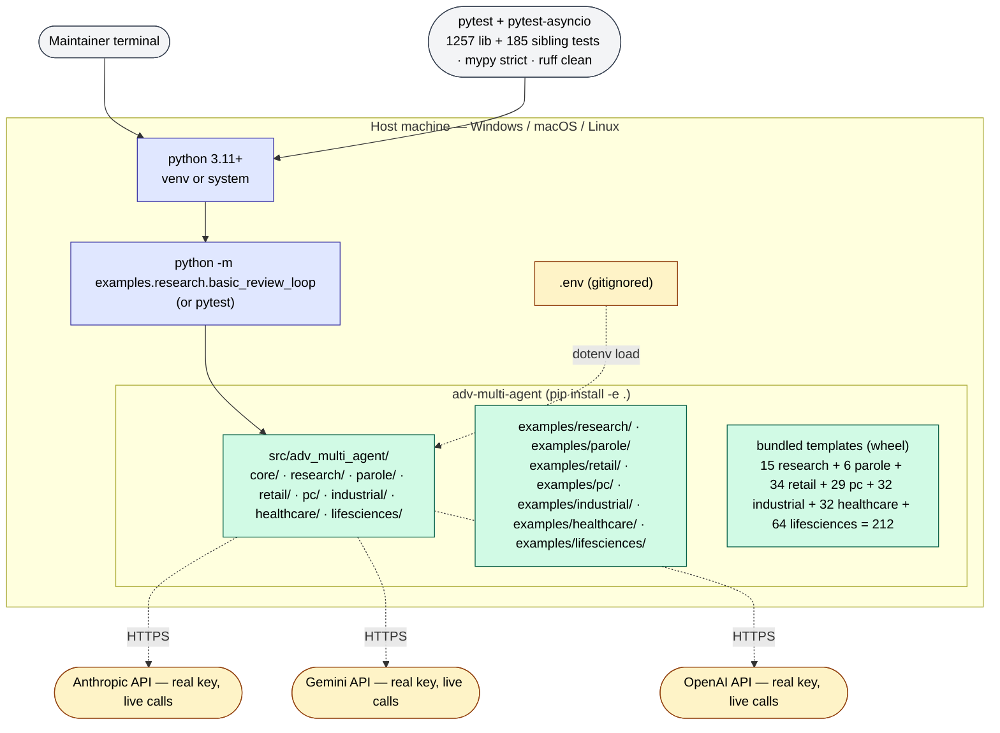

# Deployment architecture

Single-page picture of where every byte of the library runs, in caller deployments and in local dev. Companion to [`architecture.md`](architecture.md) (which owns components + flows) and the example at [`../examples/research/basic_review_loop.py`](../examples/research/basic_review_loop.py) (which owns the canonical caller-side wiring).

Updated through the 2026-07-20 lifesciences Phase-2 batch B ship (catalog COMPLETE at 27/27). Prior cycles: durable POC + 5 production siblings (durable_postgres · _k8s · _otel · cipher_gcp_kms · cipher_aws_kms) + Tier-2.1 multi-tenant; 2026-05-16 healthcare ([`security-audits/2026-05-16-healthcare-sweep.md`](security-audits/2026-05-16-healthcare-sweep.md)); 2026-05-14 industrial + PC; 2026-05-12 initial.

---

## 1. Caller-side topology (V0)

```mermaid
flowchart TB
    classDef ext fill:#fef3c7,stroke:#92400e,color:#000
    classDef proc fill:#e0e7ff,stroke:#3730a3,color:#000
    classDef lib fill:#d1fae5,stroke:#065f46,color:#000
    classDef fs fill:#fff7ed,stroke:#9a3412,color:#000
    classDef user fill:#f3f4f6,stroke:#374151,color:#000

    Researcher(["Researcher / pipeline operator"]):::user
    Env(["Environment vars<br/>ANTHROPIC_API_KEY · OPENAI_API_KEY · GEMINI_API_KEY<br/>EXECUTOR_PROVIDER · REVIEWER_PROVIDER · SKILLS_DOMAIN<br/>EFFORT_LEVEL · MAX_REVIEW_ROUNDS · SCORE_THRESHOLD"]):::ext
    Anthropic(["Anthropic Messages API<br/>api.anthropic.com:443<br/>claude-opus-4-7"]):::ext
    Gemini(["Google Gemini API<br/>generativelanguage.googleapis.com:443<br/>gemini-2.5-pro"]):::ext
    OpenAI(["OpenAI Chat Completions<br/>api.openai.com:443<br/>gpt-4o"]):::ext

    subgraph Process["Caller Python process - asyncio event loop"]
        direction TB
        Caller["Caller code<br/>asyncio.run workflow.run"]:::proc

        subgraph Lib["adv-multi-agent library"]
            direction TB
            Cfg["Config<br/>(validated · path-sandboxed · key-redacted)"]:::lib
            subgraph Research["research/"]
                Workflows["Workflows<br/>AutoReviewLoop · IdeaDiscovery · Rebuttal<br/>ManuscriptAssurance"]:::lib
                Assurance["Assurance<br/>ClaimVerifier · ScientificEditor"]:::lib
            end
            subgraph ParoleDom["parole/"]
                ParoleWf["ParoleAssessmentWorkflow<br/>(advisory brief · BIAS FLAGS gate)"]:::lib
            end
            subgraph RetailDom["retail/ (8)"]
                RetailWf["demand · labor · recall (veto)<br/>loyalty · promo · supplier<br/>inventory · private_label"]:::lib
            end
            subgraph PCDom["pc/ (7 · Foundational + Specialty)"]
                PCWf["claims_reserve (veto) · coverage_decision (veto)<br/>commercial_underwriting · cyber_underwriting<br/>environmental_impairment (veto) · parametric_crop<br/>gig_platform_liability (veto)"]:::lib
            end
            subgraph IndDom["industrial/ (8 MVP · 27 catalog)"]
                IndWf["make_vs_buy · supplier_qualification<br/>engineering_change_order · quality_incident_root_cause<br/>product_liability_root_cause (veto)<br/>recall_scope_manufacturing (veto)<br/>supply_chain_resilience · telematics_anomaly_triage"]:::lib
            end
            subgraph HealthDom["healthcare/ (8 MVP · 27 catalog)"]
                HD["diagnosis_code_audit · discharge_planning_risk<br/>prior_authorization_review · claims_appeal_review<br/>drug_interaction_flagging (veto) · adverse_event_triage (veto)<br/>treatment_plan_review (veto) · clinical_trial_eligibility (veto+bias)"]:::lib
            end
            subgraph LifeSciDom["lifesciences/ (27 of 27 catalog · COMPLETE)"]
                LSD["substantial_equivalence_510k (veto) · assay_performance_claim (veto)<br/>combination_product_pmoa · device_reportability (veto)<br/>field_action_classification (veto) · promotional_off_label_review (veto)<br/>design_control_traceability · nutrition_health_claim<br/>gxp_data_integrity · computer_system_validation · stability_shelf_life<br/>batch_release_deviation (veto) · cmo_qualification · udi_labeling<br/>clinical_protocol_design (veto) · pharmacovigilance_signal (veto)"]:::lib
            end
            subgraph CorePkg["core/"]
                Agents["Agents<br/>ExecutorAgent (Anthropic or Gemini)<br/>ReviewerAgent (OpenAI or Anthropic)"]:::lib
                Stores["Stores<br/>ClaimLedger · ResearchWiki"]:::lib
                SkillsReg["SkillRegistry · MCP server<br/>(212 bundled templates · SKILLS_DOMAIN)"]:::lib
            end

            Caller --> Cfg
            Caller --> Workflows
            Caller --> ParoleWf
            Caller --> RetailWf
            Caller --> PCWf
            Caller --> IndWf
            Caller --> HD
            Caller --> LSD
            Workflows --> Agents
            Workflows --> Stores
            Assurance --> Agents
            Assurance --> Stores
            ParoleWf --> Agents
            ParoleWf --> Stores
            RetailWf --> Agents
            RetailWf --> Stores
            PCWf --> Agents
            PCWf --> Stores
            IndWf --> Agents
            IndWf --> Stores
            HD --> Agents
            HD --> Stores
            LSD --> Agents
            LSD --> Stores
        end
    end

    subgraph WS["workspace_dir - sandboxed by Config"]
        direction TB
        Ledger[("ledger.json - atomic temp fsync rename")]:::fs
        Wiki[("wiki.json - atomic temp fsync rename")]:::fs
        Skills[("bundled templates wheel - local skills_dir override")]:::fs
    end

    Researcher -- "configures + invokes" --> Caller
    Env -- "read at Config post_init" --> Cfg
    Agents -- "HTTPS streaming<br/>(adaptive thinking)" --> Anthropic
    Agents -- "HTTPS<br/>(thinking_budget)" --> Gemini
    Agents -- "HTTPS<br/>(temperature=0.3)" --> OpenAI
    Stores --> Ledger
    Stores --> Wiki
    SkillsReg --> Skills
```



### Trust + secrets

| Surface | Where the secret lives | Notes |
|---|---|---|
| `ANTHROPIC_API_KEY` | Caller's env / `.env` | Required if `executor_provider=anthropic` or `reviewer_provider=anthropic`. Never returned by `__repr__` / `__str__` / `safe_dict()`. |
| `OPENAI_API_KEY` | Caller's env / `.env` | Required iff `reviewer_provider=openai` (default). `Config.__post_init__` raises if empty in that case. Same redaction invariant. |
| `GEMINI_API_KEY` | Caller's env / `.env` | Required iff `executor_provider=gemini`. Same redaction invariant. |
| `EXECUTOR_PROVIDER` | Caller's env / `.env` (default `anthropic`) | `anthropic` \| `gemini`. Selects `_AnthropicExecutor` or `_GeminiExecutor` backend. |
| `REVIEWER_PROVIDER` | Caller's env / `.env` (default `openai`) | `openai` \| `anthropic`. Same-family pairing raises `UserWarning`. |
| `SKILLS_DOMAIN` | Caller's env (default `research`) | `research` \| `parole` \| `retail` \| `pc` \| `industrial` \| `healthcare` \| `lifesciences`. Selects which bundled template set the MCP server loads. Cf. L-IND-4 (allowlist closed 2026-05-16; `_KNOWN_DOMAINS` frozenset rejects typos via `ValueError`). |
| `EFFORT_LEVEL` | Caller's env / `.env` (default `high`) | Validated via `_effort_from_env`. Invalid value raises with named env var. |
| `MAX_REVIEW_ROUNDS` | Caller's env / `.env` (default 5) | Range-checked `[1, 50]` at construction. |
| `SCORE_THRESHOLD` | Caller's env / `.env` (default 8.0) | Range-checked `[0.0, 10.0]` at construction. |
| `workspace_dir` | Caller-supplied via Config | Resolved to absolute path; all other paths sandboxed under it (`safe_resolve_path`). |
| Skill content | Bundled wheel templates or files under `skills_dir` | Treated as trusted-by-caller. Non-recursive glob + symlink-escape rejection + name regex + size cap. |

### Paths through the system

| Action | Touches |
|---|---|
| Caller runs `AutoReviewLoop` | Caller → `Config` (validate keys + sandbox paths) → `AutoReviewLoop.run` → per round: `Wiki.context_for_round` (fenced, IMPROVEMENT-excluded) → `Executor.run` (Anthropic streaming) → `Ledger.add` (atomic JSON write) → `Reviewer.review` (OpenAI JSON) → `Wiki.add_feedback` |
| Caller runs `ClaimVerifier` post-loop | `Ledger.pending` → reviewer stage 1 (integrity) → per claim: reviewer stage 2 (mapping) → reviewer stage 3 (audit, truncated to `audit_context_chars`) → `Ledger.resolve / dispute / retract` |
| Caller runs `ScientificEditor` | Input size check (≤200K chars) → 5 sequential `Executor.run` calls → `Reviewer.run` spot-check → `parse_first_json_or` → `EditingReport` |
| Caller runs `IdeaDiscovery` | `Executor.run` (survey) → `Wiki.add(LITERATURE)` → `Reviewer.run` (novelty, raw) → `Wiki.add(NOTE)` → `Executor.run` (proposal) → `Wiki.add(HYPOTHESIS)` |
| Caller runs `RebuttalWorkflow` | `Executor.run` (triage) → `Wiki.add(NOTE)` → `Executor.run` (draft) → `Reviewer.run` (adversarial check) → `_parse_issues` → optional `Executor.run` (finalise) → `Wiki.add(NOTE final)` |
| Caller runs `ManuscriptAssurance` | `AutoReviewLoop.run` → `ClaimVerifier.verify` (on PENDING claims) → `ScientificEditor.edit` → `WorkflowResult` with merged metadata |
| Caller runs `ParoleAssessmentWorkflow` | `sanitize_for_prompt(case fields)` → per round: `Executor.run` (advisory brief) → `Ledger.add` (claims) → `Reviewer.review` (quality score + bias_flags) → `Wiki.add_feedback` → converge iff `score ≥ threshold AND not bias_flags` → inject disclaimer + board checklist |
| Caller runs `DemandForecastWorkflow` | `sanitize_for_prompt(request fields)` → per round: `Executor.run` (forecast + recommendation) → `Ledger.add` (claims) → `Reviewer.review` (quality score + assumption_flags) → `Wiki.add_feedback` → converge iff `score ≥ threshold AND not assumption_flags` → inject disclaimer + buyer checklist |
| Caller runs `LaborSchedulingWorkflow` | `sanitize_for_prompt(request fields)` → per round: `Executor.run` (weekly schedule) → `Ledger.add` (claims) → `Reviewer.review` (quality score + compliance_flags) → `Wiki.add_feedback` → converge iff `score ≥ threshold AND not compliance_flags` → inject disclaimer + manager checklist |
| Caller runs any retail / pc / industrial / healthcare / lifesciences **triple-flag** workflow | `sanitize_for_prompt(request fields, per-field cap 1500, post-concat cap 6000)` → per round: `Executor.run` → `Ledger.add` (claims, 200/round cap) → `Reviewer.review` (quality + 3 flag classes) → `extract_flags(critique, header)` per class (line-anchored + hyphen-tolerant sibling-stop) → `Wiki.add_feedback` → converge iff `score ≥ threshold AND every flag list empty` → inject `_DISCLAIMER` + approver checklist |
| Caller runs any **veto-using** workflow (`retail.recall_scope`, `pc.claims_reserve / coverage_decision / environmental_impairment / gig_platform_liability`, `industrial.product_liability_root_cause / recall_scope_manufacturing`, `healthcare.drug_interaction_flagging / adverse_event_triage / treatment_plan_review / clinical_trial_eligibility`, `lifesciences.substantial_equivalence_510k / assay_performance_claim / promotional_off_label_review / device_reportability / field_action_classification / batch_release_deviation / clinical_protocol_design / pharmacovigilance_signal`) | Same as triple-flag, PLUS: after flag extraction → `Wiki.add_feedback` (audit-trail write **before** veto check, regulator-defensible) → `extract_veto_directive(critique)` (shared helper, M-PC-1 / M2 / L5 / H-IND-1 hardened) → break loop on any veto · `_compose_output` prepends `_VETO_BANNER` to draft (draft preserved, not replaced) → metadata captures `veto_reason` + `vetoed=True` + flags from vetoed round. Healthcare veto workflows use score threshold 8.0 (D-HEALTH-2); reviewer criteria cite specific regulatory references — FDA 21 CFR 312, ICH E2A, JAMA 2019 demographic-bias literature (D-HEALTH-4) — not generic phrasing. |
| Caller approves improvement | Caller inspects `result.metadata["pending_improvement_ids"]` → `workflow.wiki.get(id)` → human review → `workflow.wiki.approve_improvement(id)` (atomic write) |
| Caller reloads skills after editing `.md` files | `workflow.skills.reload()` (if SkillRegistry attached) → non-recursive glob → frontmatter parse → name/identifier/size validation → in-memory dict swap |
| Process receives SIGINT mid-write | `atomic_write_text` writes to `.{name}.{pid}.tmp` → fsync → `os.replace` → never leaves a torn JSON file; on next start `_load()` sees either the prior version or the new one |
| Caller catches `Config` in a traceback | `__repr__` renders secret fields as `<redacted>` / `<unset>` — exception serializers, pytest assertion diffs, Sentry breadcrumbs never see the raw key |

---

## 2. Local dev topology



### Differences from a caller deployment

| Concern | Local dev | Caller deployment |
|---|---|---|
| Install | `pip install -e .` against this repo | `pip install adv-multi-agent` (PyPI publish pending credentials) |
| API keys | Real keys in `.env` (gitignored) | Caller's secret manager / CI variable |
| Workspace | Repo root (`./ledger.json`, `./wiki.json` auto-created and sandboxed there) | Caller-controlled (`Config(workspace_dir="/var/lib/research")`) |
| Skill files | Bundled in wheel (256 templates across 7 domains); local override via `Config(skills_dir=...)` | Same |
| Network | Live API calls — costs real money per run | Same — there is no mock mode |
| Tests | **1257 library tests + 185 sibling tests**: `pytest -k unit` (pure logic, no API) + `pytest -k integration` (fake agents via DI) covering all 7 domains + durable subpackage + 5 production sibling deployments | Caller writes their own tests against their workflows |

### How to run the canonical example

```powershell
# From the repo root, PowerShell on Windows:
Copy-Item .env.example .env
# Edit .env: ANTHROPIC_API_KEY=sk-ant-... ; OPENAI_API_KEY=sk-...
python -m pip install -e .
python -m examples.research.basic_review_loop
```

Expected output: header line with executor + reviewer model IDs, the converged abstract, ledger summary dict, and either an empty pending-improvement list or one-per-line summaries. If the run prints pending improvements, the caller (you) decides whether to call `workflow.wiki.approve_improvement(id)` — see [`SECURITY_MODEL.md`](SECURITY_MODEL.md) row "Self-improvement proposal auto-adoption".

---

## Optional durable scheduler

`core/durable/SchedulerDaemon` runs paused workflows on a polling cadence. Single-process for POC; production paths:

- **Storage:** swap `FileCheckpointStore` for `PostgresCheckpointStore` impl satisfying the `CheckpointStore` Protocol (one table, `run_id` PK, JSONB column, B-tree on `(status, wake_at)`).
- **Locking:** swap `FileRunLock` for `PostgresAdvisoryLock` (pg_try_advisory_lock) or `RedisRunLock` (Redlock).
- **Scheduling:** swap `PollingScheduler` for `CeleryBeatScheduler`/`TemporalScheduler`/`pg_boss` satisfying `SchedulerBackend`.

Operator concerns:
- `FileCheckpointStore` requires writable `workspace_dir/checkpoints/` and MUST be constructed with `workspace_dir=` to enable path-confinement (H-DUR-3 mitigation).
- Paused checkpoints store `last_request_json` as raw caller-supplied data. For PHI deploys, ship an encrypted-at-rest `CheckpointStore` impl OR confine `workspace_dir` to an encrypted volume (H-DUR-4).
- `SchedulerDaemon.run_forever()` is a long-running async task; supervise it under systemd / k8s.

---

## 3. What's NOT in this picture

These exist in design or in scope, but are intentionally inert at V0:

- **MCP server is a tool-registration surface, not a daemon.** `adv-multi-agent-skills` (`python -m adv_multi_agent.core.skills.mcp_server`) runs as a stdio subprocess registered with Claude Code — it is not a persistent HTTP server or background process. It exposes skill templates as tools; it does not execute workflows or hold session state. `SKILLS_DOMAIN` selects the template set.
- **No queue, no scheduler, no background worker.** Every API call happens inside an awaited workflow call. No `asyncio.create_task` for fire-and-forget. Caller drives the event loop.
- **No DB.** Persistence is local JSON. Postgres / SQLite backends are V1 territory.
- **No multi-tenant.** A single Python process owns one `workspace_dir`. Two processes pointing at the same files race; document the limit, don't fix it at V0.
- **No retry layer.** Rate-limit / 5xx / network errors raise immediately. Caller wraps with their own backoff (`tenacity` or similar). See [`architecture.md`](architecture.md) §9 A1.
- **No audit log of model I/O.** stdout + the user's chosen logging is all there is. Regulated-context users add their own at the caller layer.
- **No Bedrock / Vertex executor.** [`decisions.md`](decisions.md) #1 locks 1P Anthropic for V0. Cross-provider via Bedrock / Vertex is a V1 decision-matrix item.
- **No deterministic seed.** Adaptive thinking is non-deterministic by design. Same Config + same task → meaningfully different runs. Don't gate any CI test on byte-identical output.
- **No webhook surface.** Self-improvement approval, claim verification, editing — all caller-driven. There is no callback target for external systems to push into.

---

## 4. Diagram source-of-truth

Update this file when:

- A new external integration is added (e.g. Bedrock, Vertex, Cohere)
- A new runtime surface is added (e.g. an MCP server wrapper, a CLI entry point)
- A secret moves between caller and library (e.g. an OAuth flow replaces the env-var key)
- A persistence backend swaps in (SQLite, Postgres)
- A workflow surfaces a new caller-visible state (e.g. paused-mid-loop resume)

Don't update this file for:

- Per-PR plumbing changes (those land in [`NEXT_SESSION.md`](NEXT_SESSION.md))
- Internal refactors that don't move a boundary (those land in [`superpowers/specs/`](superpowers/specs))
- Process / workflow changes inside a single component (those land in the component retro-spec)
