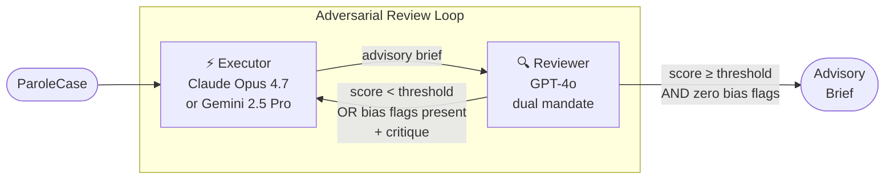

# Parole Assessment — Executive Brief

**Date:** May 2026
**Author:** Giri Manchaiah
**Status:** Teaching / research demonstration · NOT FOR PRODUCTION DEPLOYMENT

## What it is

`ParoleAssessmentWorkflow` applies adversarial multi-agent collaboration to parole decision support. Two AI models from different provider families analyze a case independently and iterate until the output meets a quality threshold *and* passes a bias audit. The result is an advisory brief for a human parole board — never a verdict.

## The Problem

Parole decisions affect liberty. Single-analyst assessments carry compounding risks: confirmation bias anchors on the first impression, protected-class proxies enter analysis through demographic language, and framing effects cause identical facts to yield different recommendations. Manual multi-reviewer processes exist but are resource-intensive and inconsistent.

## The Approach

The same adversarial loop that improves research manuscripts is applied to case analysis — with one critical addition: a mandatory bias gate.

The reviewer operates under two independent mandates every round: a **quality/balance audit** (evidence grounding, proportionality, completeness) and a **bias audit** (protected-class language, demographic proxies, differential weighting). Both must clear before the loop converges.

## What it Produces

An advisory brief structured across six evidence sections, each backed by a dedicated skill template:

| Section | Content |
|---|---|
| Risk factor analysis | Named risk domains, severity, recency weighting |
| Rehabilitation evidence | Programme quality, behavioural change indicators, clinician notes |
| Reentry plan assessment | Housing, employment, support, risk-specific programming — rated Strong / Moderate / Weak |
| Supervision conditions | Specific, proportionate, enforceable, time-bounded — one condition per risk factor |
| Advisory recommendation | Structured recommendation with evidence summary and mandatory disclaimer |
| Bias audit log | All flags raised across rounds and their resolution |

Every output ends with a programmatically injected disclaimer: *"This document does not constitute a parole decision or legal advice. The parole board retains full decision-making authority."* The disclaimer cannot be suppressed by prompt content.

## What it Does Not Do

The workflow does **not** make a parole decision. It does not replace the board. It does not verify facts independently. It does not enforce legal jurisdiction requirements. It is an analytical scaffold — the board's judgment, augmented.

## Key Design Properties

**Dual convergence gate** — quality score threshold *and* zero bias flags. A high-scoring brief with unresolved bias flags does not converge; the executor must revise.

**Caller-enforced redaction** — race, gender, ZIP code, school name, and socioeconomic identifiers must be stripped before constructing the `ParoleCase`. The workflow applies `sanitize_for_prompt()` at every injection boundary but cannot enforce upstream redaction.

**Claim ledger** — every factual assertion in the brief is registered, tracked, and queryable. The board receives a verification checklist of contacts and documents that must be independently confirmed before the meeting.

**Programmatic disclaimer** — injected in code, not in a prompt template. Cannot be removed by prompt injection or model output.

**Same infrastructure, different domain** — `ParoleAssessmentWorkflow` extends `BaseWorkflow` from `core/`. All security properties (key redaction, path sandboxing, atomic writes, injection controls) are inherited.

## Status

| Property | Status |
|---|---|
| Core workflow | ✅ Complete |
| 6 parole skill templates | ✅ Complete |
| Bias-gate convergence | ✅ Complete |
| Board checklist output | ✅ Complete |
| Example (`examples/parole/parole_assessment.py`) | ✅ Complete |
| Spec (`docs/superpowers/specs/2026-05-12-parole-assessment-spec.md`) | ✅ Complete |
| Automated upstream redaction | ❌ PRODUCTION_GAP — caller responsibility |
| Jurisdiction-specific supervision rules | ❌ PRODUCTION_GAP — generic only |
| Validated bias benchmark | ❌ PRODUCTION_GAP — heuristic audit only |
| Legal review of disclaimer | ❌ PRODUCTION_GAP — not reviewed by counsel |
| Append-only audit store | ❌ PRODUCTION_GAP — session-local JSON only |

## Who It Is For

**Research teams** studying bias in automated decision systems. The bias-gate convergence and claim ledger provide a structured audit trail for analysis.

**Engineering teams** evaluating the adversarial multi-agent pattern for high-stakes domains. The parole workflow is the reference implementation for adding a new domain to the library.

**Organizations** considering AI-assisted decision support in regulated contexts. The PRODUCTION_GAPS checklist explicitly names what must be resolved before deployment — jurisdiction rules, PII scrubbing, audit persistence, legal review.

## Next Actions

| Action | Owner | Notes |
|---|---|---|
| Upstream redaction pipeline | Engineering | Scrub demographic proxies before `ParoleCase` construction |
| Jurisdiction rule library | Legal + Engineering | Supervision condition limits vary by state/country |
| Bias benchmark study | Research | Validate audit against known-biased synthetic cases |
| Legal disclaimer review | Legal | Per-jurisdiction counsel sign-off required |
| Append-only audit store | Engineering | Replace session-local JSON with durable, tamper-evident log |
