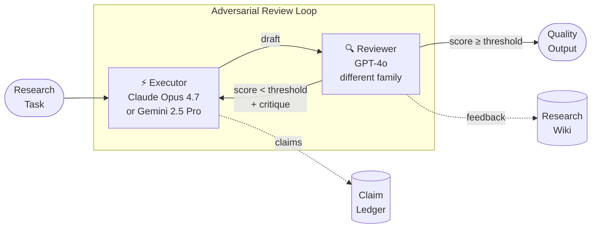

# Executive Brief: adv-multi-agent

**Date:** May 2026
**Author:** Giri Manchaiah
**Status:** Production-ready · Phases 1–8 complete · PyPI publish pending

---

## Summary

`adv-multi-agent` is a production-ready Python library that applies adversarial multi-agent collaboration to research automation. Two AI models from different providers — a generator and an adversarial reviewer — iterate on research tasks until the output meets a quality threshold. The pattern is grounded in peer-reviewed research (ARIS, SJTU 2026) and addresses a fundamental limitation of single-model pipelines: a model cannot genuinely challenge its own output.

---

## Problem

AI-assisted research pipelines that use a single model for both generation and review produce systematically correlated errors. The reviewer shares the generator's blind spots, training biases, and reasoning shortcuts, so low-quality outputs receive high scores and errors go undetected. This is not a model capability issue — it is an architectural one.

---

## Solution

Pair models from different provider families. Different architectures mean different failure modes, which means genuine adversarial scrutiny rather than self-validation. The library enforces this pattern structurally: the executor (Claude Opus 4.7 or Gemini 2.5 Pro) and reviewer (GPT-4o by default) are always cross-family, and same-family configurations surface a warning at startup.

The loop runs until the reviewer's score exceeds a configurable threshold or a round cap is reached — a dual criterion that balances quality against cost.

---

## How It Works

Every factual claim the executor makes is registered in the **Claim Ledger** and tracked through `PENDING → SUPPORTED / DISPUTED / RETRACTED`. Reviewer feedback and prior findings accumulate in the **Research Wiki** and are injected as context in subsequent rounds — so the loop gets smarter as it runs. Self-improvement proposals from the AI are held in quarantine and require explicit human approval before adoption.

---

## What Was Built

Five production-grade research workflows, a persistent knowledge layer, an extensible skill system, and a Model Context Protocol (MCP) server — all installable as a single Python package.

**Workflows**

| Workflow | Purpose |
|---|---|
| Auto Review Loop | Core adversarial iteration — any generation task |
| Idea Discovery | Literature survey → novelty check → research proposal |
| Rebuttal | Point-by-point peer-review rebuttal drafting |
| Claim Verifier | 3-stage verification of every factual assertion |
| Manuscript Assurance | End-to-end chain: review → verify → edit |

**Knowledge layer** — Persistent across runs: a claim ledger and a research wiki. Self-improvement proposals from the AI are quarantined and require explicit human approval before adoption.

**Skill system** — 21 skills ship with the package (15 research + 6 parole). New skills are plain Markdown files; no code changes required to add capabilities. Skills are domain-scoped: `SkillRegistry.bundled_skills_path(domain='research'|'parole')`.

**Multi-provider** — The executor supports both Anthropic (Claude Opus 4.7) and Google Gemini (2.5 Pro). Effort levels map portably across providers. AWS Bedrock is deferred pending a concrete need.

**MCP server** — The skill registry is exposed as an MCP server (`adv-multi-agent-skills`), making skills available as tools directly inside Claude Code with one command. The `SKILLS_DOMAIN` env var selects the domain (`research` or `parole`).

---

## Current State

| Phase | Scope | Status |
|---|---|---|
| Core library | Agents, ledger, wiki, 5 workflows, skills | ✅ Complete |
| Test coverage | 181 tests, mypy strict, ruff clean | ✅ Complete |
| Packaging | Wheel + sdist, `twine check` passed, namespace correct | ✅ Complete |
| Multi-provider | Anthropic + Gemini executor, full test coverage | ✅ Complete |
| MCP server | SkillRegistry as Claude Code tools, 12 smoke tests | ✅ Complete |
| Gemini example | Cross-provider demo with streaming | ✅ Complete |
| Domain subpackages | `core/`, `research/`, `parole/`; parole use case + 6 skills | ✅ Complete |
| PyPI publish | `twine upload` | **Pending credentials** |

The library is production-grade: fully typed (mypy strict), async throughout, atomic persistence, API keys redacted from all logs, and prompt injection mitigated at every boundary.

---

## Strategic Value

**For research teams.** Drops into any Python research pipeline in one `pip install`. Replaces ad-hoc "ask the AI to review itself" patterns with a structured, auditable loop that actually applies adversarial pressure.

**For engineering teams.** Clean extension points: add a skill (one Markdown file), swap a provider (one environment variable), build a custom workflow (one Python class), or expose the skill library to any MCP-compatible AI tool with one CLI command.

**For the organization.** The claim ledger creates an audit trail — every factual assertion and its verification status is recorded and queryable. Self-improvement proposals from AI are never auto-applied; they require a human gate. These properties make the pipeline defensible in regulated or high-stakes research contexts.

---

## Next Steps

| Action | Owner | Notes |
|---|---|---|
| PyPI publish | Engineering | Wheel built; needs PyPI credentials |
| AWS Bedrock | TBD | Deferred — no free tier for Claude; revisit when concrete need arises |
| Skill sub-package | TBD | Separate versioning for the skill library (`adv-multi-agent-skills`) |
