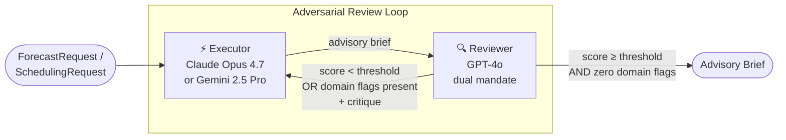

# Retail Decision Support — Executive Brief

**Date:** May 2026
**Author:** Giri Manchaiah
**Status:** Teaching / research demonstration · NOT FOR PRODUCTION DEPLOYMENT
**Based on:** Yang, R., Li, Y., & Li, S. (2026). *ARIS: Autonomous Research via Adversarial Multi-Agent Collaboration*. arXiv:2605.03042. [https://arxiv.org/abs/2605.03042](https://arxiv.org/abs/2605.03042) — Shanghai Jiao Tong University · Shanghai Innovation Institute

## What it is

`DemandForecastWorkflow` and `LaborSchedulingWorkflow` apply adversarial multi-agent collaboration to two recurring retail decisions: weekly replenishment and store labor scheduling. Two AI models from different provider families produce and challenge the recommendation, iterating until the output meets a quality threshold *and* passes a domain-specific gate (assumption audit for demand; labor-law compliance for scheduling). The output is an advisory brief for a human buyer or store manager — never an automated action.

## The Problem

Retail decisions at store-day-SKU resolution happen at scale: a typical supercenter touches ~40,000 SKUs and rebuilds a labor schedule every week. Single-model AI assistance carries compounding risks: confident but ungrounded assumptions about seasonality drive overstock and spoilage; schedule drafts pass quality review but quietly violate state labor law; cost-driven optimization erodes peak coverage and customer experience. Manual audit catches these — but not at scale.

## The Approach

The same adversarial loop that improves research manuscripts is applied to retail recommendations — with one critical addition per workflow: a mandatory domain gate.

The reviewer operates under two independent mandates every round: a **quality audit** (forecast grounding, coverage, cost) and a **domain audit** — `ASSUMPTION FLAGS` for demand (every seasonality / weather / event adjustment must be grounded in input data) or `COMPLIANCE FLAGS` for labor (every shift must satisfy stated labor-law rules). Both must clear before the loop converges.

## What it Produces

### `DemandForecastWorkflow`

| Section | Content |
|---|---|
| Demand Signal Analysis | Baseline weekly run rate, trend, variance, anomalies |
| Forecast | 4-week unit forecast with adjustments named, justified, evidence-traced |
| Replenishment Recommendation | Order quantity + order-by date + delivery window + supplier |
| Key Assumptions | Each assumption traced to an input field |
| Evidence Gaps | Information missing that would improve confidence |
| Claims | One-claim-per-line, all registered in the ledger |
| Buyer Checklist | Step-by-step verification gate before the order is placed |

### `LaborSchedulingWorkflow`

| Section | Content |
|---|---|
| Schedule | Day-by-day, named assignments, role, start, end |
| Coverage Analysis | Peak-window staffing assessment by role |
| Labor Cost Estimate | Hours per employee + total cost vs. budget |
| Compliance Notes | OT, breaks, availability — per-rule pass/fail |
| Fairness Notes | Hour distribution and availability honored |
| Evidence Gaps | Information missing that would improve schedule quality |
| Claims | One-claim-per-line, all registered in the ledger |
| Manager Checklist | Step-by-step verification gate before the schedule is published |

Both workflows append a programmatically injected disclaimer: *"This document does not constitute an order / published schedule. A qualified human retains full decision-making authority."* The disclaimer cannot be suppressed by prompt content.

## What it Does Not Do

Neither workflow places an order, publishes a schedule, integrates with POS / HCM systems, fetches live weather or unemployment data, or validates against a real labor-law database. Inputs are caller-supplied free-text; the workflow is a reasoning scaffold, not a system of record. A human buyer or manager remains the decision authority.

## Key Design Properties

**Dual convergence gate** — quality score threshold *and* zero domain flags. A high-scoring forecast with unresolved `ASSUMPTION FLAGS` does not converge; the executor must remove or ground the flagged adjustment. A high-scoring schedule with unresolved `COMPLIANCE FLAGS` does not converge; the executor must fix (not merely note) the violation.

**Caller-supplied inputs** — historical sales, staff roster, labor budget, labor-law rules are all free-text in the request dataclass. The workflow applies `sanitize_for_prompt()` at every injection boundary but cannot validate the upstream data quality.

**Claim ledger** — every factual assertion in the brief is registered, tracked, and queryable. The buyer or manager receives a checklist of facts that must be independently confirmed.

**Programmatic disclaimer** — injected in code, not in a prompt template. Cannot be removed by prompt injection or model output.

**Same infrastructure, different domain** — both workflows extend `BaseWorkflow` from `core/`. All security properties (key redaction, path sandboxing, atomic writes, injection controls) are inherited. The same code pattern that supports parole supports retail; new domains follow the same recipe.

## Status

| Property | Status |
|---|---|
| `DemandForecastWorkflow` | ✅ Complete |
| `LaborSchedulingWorkflow` | ✅ Complete |
| 9 retail skill templates (5 demand + 4 labor) | ✅ Complete |
| ASSUMPTION FLAGS gate | ✅ Complete |
| COMPLIANCE FLAGS gate | ✅ Complete |
| Buyer + manager checklists | ✅ Complete |
| Examples (`examples/retail/demand_forecasting.py`, `labor_scheduling.py`) | ✅ Complete |
| Spec + plan (`docs/superpowers/specs/2026-05-13-retail-domain-design.md`) | ✅ Complete |
| Live POS / HCM integration | ❌ PRODUCTION_GAP |
| Actuarial demand baseline (Prophet / LightGBM) | ❌ PRODUCTION_GAP — LLM should adjust the residual, not generate the baseline |
| Live weather / unemployment data feeds | ❌ PRODUCTION_GAP — caller-supplied text only |
| Automated labor-law lookup by jurisdiction | ❌ PRODUCTION_GAP — rules are caller-supplied |
| Buyer / manager approval gate enforced in code | ❌ PRODUCTION_GAP — orders / schedules must not auto-publish |
| Append-only audit store | ❌ PRODUCTION_GAP — session-local JSON only |
| Dedicated third-model assumption / compliance auditor | ❌ PRODUCTION_GAP — single-stage reviewer folds quality + domain audit; ARIS §3.1 specifies three-stage cascade; production needs a separately configured auditor model |

## Who It Is For

**Retail data and operations teams** evaluating LLM augmentation for replenishment and scheduling workflows. The convergence gates and ledger provide a structured audit trail; the `PRODUCTION_GAPS` checklist names exactly what integration work is required before pilot.

**Engineering teams** adding a new domain to the adversarial multi-agent library. The retail domain is the second reference implementation after parole — together they show the recipe for any high-stakes, data-rich domain.

**Researchers** studying how cross-model adversarial pairs reduce confident-but-wrong errors in operational decisions where ground truth is observable after the fact (forecast accuracy, compliance violations).

## Next Actions

| Action | Owner | Notes |
|---|---|---|
| POS / HCM integration adapters | Engineering | Replace free-text inputs with live transaction + roster data |
| Actuarial demand baseline | Data Science | LLM provides residual adjustments, not the baseline |
| Labor-law rule library | Legal + Engineering | Per-jurisdiction OT, break, minor-labor, predictive-scheduling rules |
| External signal feeds | Engineering | NWS weather, BLS unemployment, holiday calendar |
| Order / schedule approval gate | Engineering | Code-enforced human sign-off before downstream publish |
| Pilot study | Operations | Single store, single category, 4-week shadow run before production |
