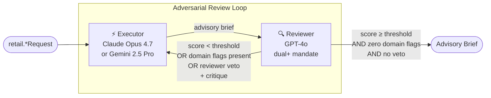

# Retail Decision Support — Executive Brief

**Date:** May 2026
**Author:** Giri Manchaiah
**Status:** Teaching / research demonstration · NOT FOR PRODUCTION DEPLOYMENT
**Based on:** Yang, R., Li, Y., & Li, S. (2026). *ARIS: Autonomous Research via Adversarial Multi-Agent Collaboration*. arXiv:2605.03042. [https://arxiv.org/abs/2605.03042](https://arxiv.org/abs/2605.03042) — Shanghai Jiao Tong University · Shanghai Innovation Institute

## What it is

Eight workflows in `adv_multi_agent.retail` apply adversarial multi-agent collaboration to the recurring retail decisions a buyer, store manager, category manager, or sourcing lead actually makes. Two AI models from different provider families produce and challenge each recommendation, iterating until the output meets a quality threshold *and* passes one to three domain-specific gates. Every output is an advisory brief for a human decision-maker — never an automated action.

## The Problem

Retail decisions at store-day-SKU resolution happen at scale. A typical supercenter touches ~40,000 SKUs and rebuilds a labor schedule every week; a category manager runs promos monthly across thousands of SKUs; a sourcing lead negotiates with hundreds of suppliers a year; a food-safety incident demands a recall scope decision in hours. Single-model AI assistance carries compounding risks: confident-but-ungrounded seasonality assumptions drive overstock and spoilage; schedule drafts pass quality review but quietly violate state labor law; promo elasticity claims are imported from training data with no link to actual price-test history; private-label launches optimise per-unit margin while destroying category margin. Manual audit catches these — but not at scale.

## The Approach

The same adversarial loop that improves research manuscripts is applied to retail recommendations — with one critical addition per workflow: one to three mandatory domain gates.

The reviewer operates under multiple independent mandates every round: a **quality audit** (grounding, coverage, cost, actionability) and **domain audits** specific to the workflow. Both must clear before the loop converges. Two patterns layer on top: a **reviewer-veto** (used by `RecallScopeWorkflow`) lets the reviewer halt the loop on a life-safety condition regardless of score, and a **triple-flag gate** (used by five of the eight workflows) requires three independent flag classes to all be empty before convergence.

## What it Produces

| Workflow | Gate | Outputs |
|---|---|---|
| `DemandForecastWorkflow` | `ASSUMPTION FLAGS` | 4-week forecast, replenishment recommendation, evidence-traced adjustments, buyer checklist |
| `LaborSchedulingWorkflow` | `COMPLIANCE FLAGS` | Day-by-day schedule, coverage analysis, labor cost, per-rule compliance, manager checklist |
| `RecallScopeWorkflow` | `SCOPE FLAGS` + `EVIDENCE FLAGS` + reviewer veto | Recall scope (lots, stores, dates), consumer-exposure assessment, regulatory-notification draft, safety-officer checklist |
| `LoyaltyOfferWorkflow` | `FAIRNESS FLAGS` + `MARGIN FLAGS` + `GAMING FLAGS` | Segment definition (allowed/disallowed attribute lists), offer mechanic, margin math with cannibalization, gaming-path mitigations, CMO checklist |
| `PromoMarkdownWorkflow` | `ELASTICITY FLAGS` + `MARGIN FLAGS` + `TIMING FLAGS` | Elasticity assumption with source, promo mechanic, central + adverse-case margin math, timing-risk mitigations, category-manager checklist |
| `SupplierBriefWorkflow` | `BATNA FLAGS` + `COST FLAGS` + `RELATIONSHIP FLAGS` | BATNA assessment, cost-floor defence, opening/landing/walk-away terms, concession order, talking points, buyer + finance + legal checklist |
| `InventoryReplenishmentWorkflow` | `LEAD-TIME FLAGS` + `STOCKOUT FLAGS` + `CAPACITY FLAGS` | Per-SKU PO schedule, stockout projection (central + adverse), capacity check, truck economics, supply-planning checklist |
| `PrivateLabelWorkflow` | `CANNIBALIZATION FLAGS` + `BRAND FLAGS` + `SUPPLY FLAGS` | Total-category-margin math, brand-fit assessment, supply-readiness verification, pricing stack, launch plan, category-management + brand + QA checklist |

Every workflow appends a programmatically injected disclaimer: *"This document does not constitute an order / published schedule / supplier proposal / launch decision. A qualified human retains full decision-making authority."* The disclaimer cannot be suppressed by prompt content.

## What it Does Not Do

No workflow places an order, publishes a schedule, sends a supplier proposal, executes a recall, commits to a co-manufacturer, or integrates with POS / HCM / WMS / ERP systems. Inputs are caller-supplied free-text; the workflow is a reasoning scaffold, not a system of record. A human decision-maker remains the authority on every output.

## Key Design Properties

**Multi-gate convergence** — quality score threshold *and* one to three domain-flag gates. A high-scoring brief with unresolved flags does not converge; the executor must remove or ground the flagged content. Convergence is a conjunction, never a disjunction.

**Reviewer-veto for irreversible decisions** — `RecallScopeWorkflow` extends the gate with a veto channel: the reviewer can emit `REVIEWER VETO:` to halt the loop regardless of score. Audit-trail writes happen *before* the veto break — the safety officer sees what was vetoed and why.

**Caller-supplied inputs** — historical sales, staff roster, labor-law rules, lab results, supplier costs, brand positioning are all free-text in the per-workflow request dataclass. The workflow applies `sanitize_for_prompt()` at every injection boundary but cannot validate upstream data quality. List-of-string fields are capped at 64 entries × 200 chars each.

**Claim ledger** — every factual assertion in every brief is registered, tracked, and queryable. The decision-maker receives a checklist of facts that must be independently confirmed before acting.

**Programmatic disclaimer** — injected in code, not in a prompt template. Cannot be removed by prompt injection or model output.

**Same infrastructure, different domain** — all eight workflows extend `BaseWorkflow` from `core/`. Helper extraction (`core._internal.extract_flags`, `BaseWorkflow._register_claims`) keeps the per-workflow code focused on domain logic. All security properties (key redaction, path sandboxing, atomic writes, injection controls) are inherited.

## Status

| Property | Status |
|---|---|
| 8 retail workflows | ✅ Complete |
| 25 retail skill templates (5 demand + 4 labor + 5 recall + 4 loyalty + 4 promo + 4 supplier + 4 replenishment + 4 private-label) | ✅ Complete |
| Triple-flag gate pattern (5 of 8 workflows) | ✅ Complete |
| Reviewer-veto pattern (recall) | ✅ Complete |
| Approver checklists per workflow | ✅ Complete |
| 8 retail examples (`examples/retail/*.py`) | ✅ Complete |
| 300 unit + integration tests | ✅ All passing |
| Design doc + locked decisions (`docs/retail-sweep-design.md`, D-RETAIL-1..6 in `decisions.md`) | ✅ Complete |
| Live POS / HCM / WMS / ERP integration | ❌ PRODUCTION_GAP |
| Actuarial demand baseline (Prophet / LightGBM) | ❌ PRODUCTION_GAP — LLM should adjust the residual, not generate the baseline |
| Live weather / unemployment / commodity / freight feeds | ❌ PRODUCTION_GAP — caller-supplied text only |
| Automated labor-law lookup by jurisdiction | ❌ PRODUCTION_GAP — rules are caller-supplied |
| Structured supplier-audit + co-manufacturer registry | ❌ PRODUCTION_GAP — audit dates and capacity are caller-supplied text |
| Household-basket cannibalization model | ❌ PRODUCTION_GAP — substitution rates are caller-supplied |
| Human approval gate enforced in code | ❌ PRODUCTION_GAP — orders / schedules / POs / launches must not auto-publish |
| Append-only audit store | ❌ PRODUCTION_GAP — session-local JSON only |
| Dedicated third-model auditor cascade (ARIS §3.1) | ❌ PRODUCTION_GAP — single-stage reviewer folds quality + domain audit; production needs a separately configured auditor model per high-stakes flag class |

## Who It Is For

**Retail data, operations, commercial, and safety teams** evaluating LLM augmentation across the decision surface — replenishment, scheduling, recall, loyalty, promo, supplier negotiation, inventory, private-label. The convergence gates and ledger provide a structured audit trail; the per-workflow `PRODUCTION_GAPS` checklist names exactly what integration work is required before a pilot.

**Engineering teams** adding a new domain to the adversarial multi-agent library. The retail domain is the second reference implementation after parole and the first to cover a full vertical (operations + commercial + customer + safety). The recipe is locked: per-workflow `*Request` dataclass, one to three domain-flag gates, `extract_flags` + `_register_claims` from shared helpers, `_DISCLAIMER` banner, approver checklist, skill templates with a scenario-noun prefix.

**Researchers** studying how cross-model adversarial pairs reduce confident-but-wrong errors in operational decisions where ground truth is observable after the fact (forecast accuracy, compliance violations, post-promo lift, recall completeness, supplier-negotiation outcome).

## Next Actions

| Action | Owner | Notes |
|---|---|---|
| POS / HCM / WMS / ERP integration adapters | Engineering | Replace free-text inputs with live transaction, roster, inventory, and order data |
| Actuarial demand baseline + cannibalization model | Data Science | LLM provides residual adjustments and decision context, not the baseline |
| Labor-law + ESG + compliance rule library | Legal + Engineering | Per-jurisdiction rules; corporate ESG policy registry |
| Co-manufacturer + supplier audit registry | Sourcing + QA + Engineering | Structured last-audit-date, capacity, recall-readiness per vendor |
| External signal feeds | Engineering | Weather, unemployment, holiday calendar, commodity / freight / FX indices |
| Human approval gate enforced in code | Engineering | Order / schedule / PO / proposal / launch must not auto-publish |
| Pilot studies | Operations + Commercial | Single category, single DC, single store — 4-week shadow run per workflow before any production exposure |
