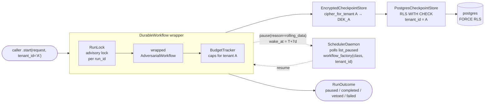

# Durable Long-Running Agents — Executive Brief

**Date:** May 2026
**Author:** Giri Manchaiah
**Status:** Reference deployment shipped (POC scope) · multi-tenant production-ready post-audit · NOT FOR PRODUCTION DEPLOYMENT WITHOUT POSTGRES + KMS + OPERATOR REVIEW
**Based on:** Yang, R., Li, Y., & Li, S. (2026). *ARIS: Autonomous Research via Adversarial Multi-Agent Collaboration*. arXiv:2605.03042. Shanghai Jiao Tong University · Shanghai Innovation Institute

---

## What it is

`core/durable/` is a composition wrapper for any `AdversarialWorkflow` that enables **pause-resume execution across days or weeks** without losing context, audit trail, budget accounting, or model pinning. The wrapper is domain-agnostic — the same primitives that pause a clinical-trial-eligibility loop for rolling lab data also pause a parts-demand-forecast loop for a missing supplier reading. Five production sibling deployments accompany the library: `durable_postgres` (compose + cipher + lock + store + scheduler + RLS), `durable_postgres_k8s` (kustomize), `durable_postgres_otel` (OTel collector + Prometheus + Grafana + alerts), `cipher_gcp_kms` and `cipher_aws_kms` (envelope encryption with per-tenant DEK isolation). The library ships zero secrets, zero scheduler infrastructure, and zero KMS dependencies — the caller composes those, the contract is enforced through three Protocols.

---

## The Problem

Adversarial review loops were designed for synchronous decisions: one request, N rounds, one converged answer. Real high-stakes domains stretch the loop across days or weeks. **Without durability, every pause means full context replay** — cost compounds, drift surface widens, the audit trail fragments, the pinned executor model may have been retired since round 1, the budget cap may already have been exceeded before the resume even starts, and the reviewer's veto from a prior round can silently disappear. Production deployments add operational dimensions the library must surface, not hide: **encryption at rest** (PHI / claims / personally identifiable data sealed under an operator-owned cipher), **integrity** (insider tampering with `workflow_version_hash` or `rounds_history` breaks the 21 CFR Part 11 attestation chain), **multi-tenancy** (one daemon serving N customers without cross-tenant payload leakage or budget bleed), **observability** (which tenant is over budget *right now*?), and **graceful failure** (a missing KMS key, a poison checkpoint, a config error must not silently lose work). Single-model durable-execution frameworks (Temporal, Restate, Inngest, AWS Step Functions, LangGraph checkpointing) handle replay-deterministic activities; agent calls are non-deterministic by design and the wedge requires agent-native + adversarial-pattern-native primitives.

---

## The Approach

`DurableWorkflow` wraps any existing `AdversarialWorkflow` unchanged — composition, not inheritance. Three Protocols (`CheckpointStore`, `RunLock`, `SchedulerBackend`) ship with file-backed POC implementations and Postgres production siblings. A fourth Protocol (`Cipher`) is decorator-applied via `EncryptedCheckpointStore`. Multi-tenancy is opt-in via resolver pattern: pass `cipher_for_tenant: Callable[[str], Cipher]` and `caps_for_tenant: Callable[[str], BudgetCaps]`, and every checkpoint write/read routes through the per-tenant cipher + the per-tenant budget cap. Postgres RLS (`FORCE ROW LEVEL SECURITY` enforced at the schema level + a CI gate) defends cross-tenant writes at the database layer; per-tenant DEK isolation defends payload confidentiality at the cipher layer. The two defenses are independent — a single-tenant key compromise leaks one tenant's data, not all.

Three named pause gates carry across every domain integration: **`rolling_data`** (caller-owned inputs change during the pause — labs pending, parts arriving, signatures collecting), **`approver_sla`** (human reviewer in the loop, days-to-weeks turnaround), **`regulatory_clock`** (FDA 21 CFR 312 7/15-day, CMS prior auth, GDPR 30-day breach notification). A `ReconciliationHook` Protocol is the single seam where caller-owned freshness logic plugs in on resume — read-only against agent state, idempotent, bounded by `Config.reconciliation_timeout_seconds`. Four reference hooks ship: `NoOpReconciliationHook`, `MergeFreshInputsHook`, `RehydrateFromCallbackHook`, `AppendFreshContextHook`.

---

## What it Produces

| Layer | Shipped artifacts |
|---|---|
| **Library `core/durable/`** | `DurableWorkflow` wrapper · `Checkpoint` / `ResumeToken` dataclasses (frozen, schema-versioned, tenant_id first-class) · 3 Protocols (`CheckpointStore`, `RunLock`, `SchedulerBackend`) · `Cipher` Protocol + `EncryptedCheckpointStore` decorator + `UnknownTenantError` · `BudgetTracker` + `BudgetCaps` value object (per-tenant resolver pattern) · 4 reconciliation hooks · workflow-version pinning + `integrity_tag` full-checkpoint AEAD · structured pause / metric / span emission |
| **Reference deployment `examples/production/durable_postgres/`** | Docker-compose stack · `PostgresCheckpointStore` (RLS-scoped writes, `SET LOCAL app.tenant_id` inside transactions, CI grep gate) · `PostgresAdvisoryLock` (two-pool model) · `FernetCipher` · `SchedulerDaemon` · `QuarantineSync` (dead-letter mirror + spike alerts) · 5-step SQL migration set 0004→0007 including FORCE RLS · operator smoke script `verify_multi_tenant.py` |
| **KMS siblings** | `cipher_gcp_kms` (envelope encryption via GCP Cloud KMS, DEK cache, IAM split between daemon SA and admin SA) · `cipher_aws_kms` (AWS KMS, IMDSv2 hardening, IRSA-aware credential rejection) · both support `cipher_for_tenant` resolver with one CryptoKey/CMK per tenant for DEK isolation |
| **Observability sibling `durable_postgres_otel/`** | OTel collector + Prometheus + Grafana dashboards · 8 alert rules (4 fleet-wide + 4 tenant-aware) · `tenant` label on every durable metric tag · cardinality fixture pinning the public metric surface |
| **K8s sibling `durable_postgres_k8s/`** | Kustomize overlays · least-privilege RBAC · network policies · resource quotas |
| **Runbooks** | `durable-integration.md` (caller integration) · `durable-operations.md` (day-2 ops) · `durable-compliance.md` (key rotation, per-tenant compromise §5.5a, multi-tenant migration §5.6) · `durable-backup-restore.md` (cluster + per-tenant export §8a) · `otel-operations.md` (alert runbook entries) |

---

## What it Does Not Do

- **Replay determinism.** Agent calls are non-deterministic by design; resume is forward-only. The `rounds_history` is a compacted audit trail, not a Temporal-style activity log.
- **Distributed scheduler.** POC scope is single-process; the `SchedulerBackend` Protocol is the swap point. `PollingScheduler` + `SchedulerDaemon` is the reference. Production swaps in Temporal / Celery Beat / AWS EventBridge / pg-boss against the same Protocol.
- **Built-in cipher.** Library ships zero cipher and zero `cryptography` / `boto3` / `google-cloud-kms` dependency. Production deployments compose `FernetCipher` or `GcpKmsCipher` or `AwsKmsCipher` — caller's choice, caller's key rotation cadence.
- **Live API integration tests in CI.** Existing repo convention; no live model calls in CI. Sibling smoke tests under `smoke_test.py` exercise live integration manually.
- **Tenant-shard scheduling at >100k paused-run scale (Tier 3.4, backlog).** Current scheduler polls all tenants; cardinality bound by daemon resolver size (~100 tenants). Operator hits this signal long before the limit; the swap to per-shard scheduling lives behind the same `SchedulerBackend` Protocol.
- **Tenant-aware backup automation (Tier 3.5, backlog).** Manual procedure documented in `durable-backup-restore.md` §8a (`pg_dump --where="tenant_id='X'"` + per-tenant cipher decrypt path); the automated `scripts/backup_tenant.py` is sibling-only scope.

---

## Key Design Properties

**Composition over inheritance.** Every existing healthcare / retail / PC / industrial / parole / research workflow runs unchanged inside `DurableWorkflow`. No domain source file moved when durability shipped. Same pattern when multi-tenancy shipped: `Checkpoint.tenant_id` became a first-class required field, but the wrapper's posture is unchanged — domain workflows do not know they are running under multi-tenancy.

**Sanitization upstream of persistence (D-DURABLE-1).** `*Request.to_prompt_text()` applies the shared `sanitize_for_prompt` + `_MAX_FIELD_CHARS=1500` cap before the checkpoint is written. A pause + resume cycle cannot reintroduce raw caller input. The reconciliation hook output is re-validated at the boundary (`_validate_request_shape`) before re-entering the loop.

**Trust boundary named, not silent (D-DURABLE-2).** Hook output is caller-trusted; the documentation says so; the boundary validator enforces it. The `Cipher` is caller-supplied; the library has no key custody. The `tenant_id` is caller-supplied at `start()` and stamped onto the checkpoint — the resolver pattern means cipher selection and budget enforcement both derive from the row's own tenant_id, not from an out-of-band context.

**Defense in depth at the storage layer.** Postgres RLS enforces cross-tenant write isolation via `WITH CHECK (tenant_id = current_setting('app.tenant_id', true))` policies. `FORCE ROW LEVEL SECURITY` ensures the daemon role (often the table owner in dev/POC) is also subject — without FORCE, RLS is decorative for the owner. Per-tenant `cipher_for_tenant` resolves to distinct cipher instances; a compromised tenant's key does not decrypt other tenants' payloads. `BudgetCaps` per-tenant means one noisy tenant cannot exhaust a shared pool.

**Fail-loud over fail-silent.** `UnknownTenantError` (KeyError subclass) surfaces an unconfigured tenant_id at write time — the scheduler catches it explicitly and quarantines immediately rather than retrying as "corrupt checkpoint". `BudgetTracker(caps=BudgetCaps())` with all-None caps raises `ValueError` rather than silently allowing unbounded spend. Reserved tenant_ids (`_default`, `_legacy`) are rejected at boot when supplied as operator JSON keys, preventing collision with the library's backward-compat namespaces.

**Audit cycles compound.** Seven security audits across the durable subpackage closed 0 / 0 / 0 / 0 CRITICAL/HIGH/MEDIUM/LOW findings before the multi-tenant sweep began. The Tier 2.1d four-axis review (code / security / performance / operational) surfaced 5 BLOCKERs + 8 MEDIUMs + 4 SCALE-concerns; all BLOCKERs + MEDIUMs closed in 6 commits within the same session. The convention-level error compounding lesson (M-PC-1 / H-IND-1 — three sibling daemons holding verbatim copies of `_parse_json_map` and friends) was caught and hoisted to `examples/production/_shared/tenant_env.py` rather than letting it land in a 4th sibling.

---

## Status

| Component | Status |
|---|---|
| `core/durable/` subpackage — wrapper, checkpoint, token, budget, lock, scheduler, hooks, encryption | ✅ Shipped (Tier 1) |
| 3 Protocols + Memory + File POC impls | ✅ |
| 4 reference reconciliation hooks | ✅ |
| `EncryptedCheckpointStore` decorator + `Cipher` Protocol | ✅ |
| `workflow_version_hash` + `integrity_tag` full-checkpoint AEAD | ✅ (Tier 1.6 + 1.9) |
| `ClinicalTrialEligibilityDurableWorkflow` with 3 named pause gates | ✅ |
| `examples/healthcare/clinical_trial_durable.py` lifecycle demo | ✅ |
| `PostgresCheckpointStore` + `PostgresAdvisoryLock` + sibling daemon | ✅ Shipped (`durable_postgres`) |
| `GcpKmsCipher` + envelope encryption + DEK cache | ✅ Shipped (`cipher_gcp_kms`) |
| `AwsKmsCipher` + IMDSv2 + IRSA refusal | ✅ Shipped (`cipher_aws_kms`) |
| Kubernetes deployment target | ✅ Shipped (`durable_postgres_k8s`) |
| OTel + Prometheus + Grafana + 8 alerts (4 fleet + 4 tenant-aware) | ✅ Shipped (`durable_postgres_otel`) |
| Multi-tenant primitives — `tenant_id` first-class, RLS + FORCE RLS, `cipher_for_tenant`, `BudgetCaps`, reserved-namespace reject | ✅ Shipped (Tier 2.1a/b/c-1/c-2/sibling-1/sibling-2/d) |
| Per-tenant observability — `tenant` label on every metric, cardinality fixture, tenant-aware alerts | ✅ Shipped (Tier 2.1d / B1+B2) |
| Operator-facing isolation smoke (`scripts/verify_multi_tenant.py`) | ✅ Shipped (Tier 2.1d / B5) |
| Schema migration tool | ✅ Shipped (Tier 1.4) |
| Backup + PITR + age-encrypted dump | ✅ Shipped (Tier 1.5) |
| Quarantine / dead-letter handling | ✅ Shipped (Tier 2.4) |
| Budget enforcement (per-run + per-tenant) | ✅ Shipped (Tier 2.3 + 2.1c-2) |
| Library + sibling test coverage | 768 library + 185 sibling tests; mypy strict; ruff clean |
| Security audit cycles | 7 cycles on durable subpackage (0/0/0/0) + 4-axis Tier 2.1d audit (5 BLOCKER + 8 MEDIUM closed) |
| PyPI publish | ❌ Pending credentials |
| Tenant-shard scheduling (>100k paused-run scale) | ❌ Tier 3.4 backlog |
| Tenant-aware backup automation | ❌ Tier 3.5 backlog (manual procedure documented in §8a until then) |

---

## Who It Is For

**Engineering teams** building agent workflows that pause for human approvers, regulatory clocks, or rolling data, and that need to serve more than one customer / tenant / business unit from one daemon. The composition pattern means an existing `AdversarialWorkflow` becomes durable + multi-tenant by being passed to a `DurableWorkflow` constructor and a `start(request, tenant_id="X")` call — no rewrite, no inheritance hierarchy, no framework lock-in. Three Protocols ship with file-backed POC impls and Postgres production siblings so the storage swap is a known shape, not a discovery. Per-tenant cipher / budget resolvers are env-driven JSON maps validated at boot — operators see config errors before the first request, not at the first checkpoint write.

**Operations teams** running adversarial multi-agent loops in production where decisions stretch days to weeks and one daemon serves multiple tenants. Named pause gates (`rolling_data`, `approver_sla`, `regulatory_clock`), per-tenant Prometheus alerts (high latency, decrypt-failure spike, budget-usage above 90%, pause/resume imbalance), and per-tenant Grafana breakdowns let SRE / DevOps answer "which tenant is hot right now?" without coupling to a particular observability backend. Encryption is opt-in via decorator; per-tenant KMS keyrings give DEK isolation so a single-tenant compromise rotates that tenant's key without coordinating fleet downtime. The `verify_multi_tenant.py` smoke gate gives operators a 3-check pre-onboarding test (RLS cross-tenant rejection, UnknownTenantError fail-closed, per-tenant BudgetExceeded isolation).

**Researchers and compliance teams** studying long-horizon agent loops where context drift, model retirement, and reconciliation against external state matter for FDA 21 CFR Part 11 attestation chains, HITRUST KSP.02.05 evidence, or HIPAA breach-notification clocks. The `ReconciliationHook` Protocol is the named seam for studying how callers handle "the world moved during the pause" — a question generic durable-execution frameworks treat as out of scope. Per-tenant key compromise procedures (`durable-compliance.md` §5.5a) and per-tenant data export procedures (`durable-backup-restore.md` §8a) are documented; the integrity tag covers `tenant_id`, so insider tampering with the field invalidates the seal.

---

## Next Actions

| # | Action | Owner |
|---|---|---|
| 1 | Tier 3.4 — tenant-shard scheduling for >100k paused-run scale (swap `SchedulerBackend` to per-shard polling behind the same Protocol) | Engineering |
| 2 | Tier 3.5 — `scripts/backup_tenant.py --tenant <id>` + `restore_tenant.py` automating the §8a manual procedure | Engineering |
| 3 | Apply durable + multi-tenant wrapper to Phase-2 healthcare workflows (`PHIBreachScopeWorkflow` 60-day HIPAA clock is a natural fit) | Engineering + Compliance |
| 4 | Apply durable wrapper to industrial Phase-2 `PartsDemandForecastWorkflow` — rolling demand-signal pause × multi-tenant | Engineering |
| 5 | Cross-domain pattern: financial appeal workflows · legal discovery workflows · HR investigation workflows — each carries a natural pause gate × multi-tenancy | Engineering |
| 6 | PyPI publish (pending credentials) | Engineering |
| 7 | 90-day shadow pilot — durable + healthcare + multi-tenant combo against real IRB workflow across multiple sponsor accounts | Clinical Informatics + IRB |
| 8 | Operability follow-ups: helper boilerplate around resolver construction in caller daemons (Tier 2.1d LOW-1 backlog) | Engineering |

---

*Reference implementation:* `github.com/gmanch94/adv-multi-agent`

*Design docs:* `docs/superpowers/specs/2026-05-16-durable-agent-poc-design.md` · `docs/superpowers/specs/2026-05-18-tier-2-1-multi-tenant-design.md`
*Runbooks:* `docs/runbooks/durable-integration.md` · `durable-operations.md` · `durable-compliance.md` · `durable-backup-restore.md` · `otel-operations.md`
*Decisions:* `docs/decisions.md` D-DURABLE-1..4 · D-TENANT-0..10 · D-TENANT-2.1b-1..4 · D-TENANT-2.1c-1/2 · D-TENANT-2.1c-sibling-1/2 · D-TENANT-2.1d
*Security audits:* `docs/security-audits/` — 7 cycles on durable subpackage + Tier 2.1d 4-axis (code / security / perf / ops), all 0/0/0/0
*Test count:* 768 library + 185 sibling (mypy strict, ruff clean)
