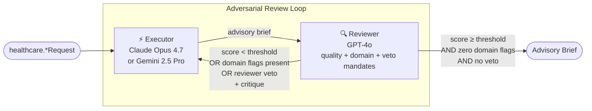

# Healthcare Domain — Executive Brief

**Date:** May 2026
**Author:** Giri Manchaiah
**Status:** Teaching / research demonstration · NOT FOR PRODUCTION DEPLOYMENT
**Based on:** Yang, R., Li, Y., & Li, S. (2026). *ARIS: Autonomous Research via Adversarial Multi-Agent Collaboration*. arXiv:2605.03042. [https://arxiv.org/abs/2605.03042](https://arxiv.org/abs/2605.03042) — Shanghai Jiao Tong University · Shanghai Innovation Institute

---

## What it is

Eight workflows in `adv_multi_agent.healthcare` apply adversarial multi-agent collaboration to recurring decisions across clinical decision support, payer operations, and drug safety — ICD-10 coding audits, discharge readiness, prior authorization, claims appeals, drug interaction flagging, adverse event triage, treatment plan review, and clinical trial eligibility. Two AI models from different provider families produce and challenge each recommendation, iterating until the output meets a quality threshold *and* passes three domain-specific flag gates; the four highest-criticality workflows additionally support a reviewer veto for absolute contraindications, mandatory regulatory reporting triggers, and protected-class bias in trial enrollment. Every output is an advisory brief for a credentialed human — never an automated clinical order, regulatory submission, PA approval, or enrollment decision.

---

## The Problem

Healthcare decisions share the four properties that make LLM error-modes uniquely costly: **irreversibility** (trial enrollment, contraindicated treatment, adverse event report — each carries patient-safety or regulatory consequence that cannot be undone), **regulator audit-trail** (FDA 21 CFR Part 11/312 ADR reporting, CMS 21st Century Cures Act prior auth timelines, HIPAA, IRB/ICH-GCP trial eligibility), **asymmetric information** (the treating clinician knows comorbidities the coder doesn't; the pharmacist knows the interaction database the prescriber paraphrased from memory; the payer reviewer knows coverage policy version the appeals coordinator is arguing against), and **echo-chamber risk** (clinicians and payer reviewers develop precedent bias; same-family LLMs replicate it — load-bearing on bias in trial enrollment and bad-faith PA denial). Single-model AI assistance carries compounding risks: operator-error framing masks design-defect signal; demographic exclusion bias in trial eligibility goes unchallenged; prior auth denials cite outdated criteria; ADR causality is assessed without checking whether the event is in current labeling.

---

## The Approach

The same adversarial loop that improves research manuscripts is applied to healthcare decisions — with one critical addition per workflow: three mandatory domain-flag gates, plus an optional reviewer veto for the patient-safety / regulatory irreversible class.

The reviewer operates under multiple independent mandates every round: a **quality audit** (grounding, coverage, methodology, actionability) and **domain audits** specific to the workflow (accuracy / compliance / specificity, readmission / care-gap / social-determinant, medical-necessity / coverage / documentation, evidence / coverage / procedure, severity / evidence / contraindication, severity / causality / regulatory, guideline / contraindication / risk, bias / eligibility / evidence). All must clear before the loop converges. The **reviewer-veto** channel is used by 4 of 8 workflows where the cost of one more iteration before halting exceeds the cost of a false-positive halt: absolute drug contraindication, mandatory expedited ADR reporting trigger, treatment-plan contraindication, and protected-class bias in trial eligibility determination.

---

## What it Produces

| # | Workflow | Gate | Outputs |
|---|---|---|---|
| 1 | `DiagnosisCodeAuditWorkflow` | `ACCURACY` + `COMPLIANCE` + `SPECIFICITY` FLAGS | ICD-10-CM/PCS code accuracy assessment, compliance exposure analysis, specificity recommendations, coder checklist |
| 2 | `DischargePlanningRiskWorkflow` | `READMISSION` + `CARE-GAP` + `SOCIAL-DETERMINANT` FLAGS | 30-day readmission risk analysis, post-acute care gaps, SDOH barrier identification, discharge planner checklist |
| 3 | `PriorAuthorizationReviewWorkflow` | `MEDICAL-NECESSITY` + `COVERAGE` + `DOCUMENTATION` FLAGS | Medical necessity evidence audit, coverage policy alignment, documentation gap list, PA nurse/case manager checklist |
| 4 | `ClaimsAppealReviewWorkflow` | `EVIDENCE` + `COVERAGE` + `PROCEDURE` FLAGS | Appeal evidence strength analysis, coverage policy cross-reference, procedure coding review, appeals coordinator/medical director checklist |
| 5 | `DrugInteractionFlaggingWorkflow` | `SEVERITY` + `EVIDENCE` + `CONTRAINDICATION` FLAGS + reviewer veto | Interaction severity classification, evidence grounding, contraindication analysis, clinical pharmacist checklist |
| 6 | `AdverseEventTriageWorkflow` | `SEVERITY` + `CAUSALITY` + `REGULATORY` FLAGS + reviewer veto | ADR severity/causality assessment, 7/15-day expedited reporting determination, regulatory filing scope, pharmacovigilance officer checklist |
| 7 | `TreatmentPlanReviewWorkflow` | `GUIDELINE` + `CONTRAINDICATION` + `RISK` FLAGS + reviewer veto | Guideline concordance analysis, contraindication screen, risk-benefit assessment, attending physician checklist |
| 8 | `ClinicalTrialEligibilityWorkflow` | `BIAS` + `ELIGIBILITY` + `EVIDENCE` FLAGS + reviewer veto | Protocol eligibility determination, demographic-bias audit (JAMA 2019 Duma et al.), evidence grounding, IRB coordinator/PI checklist |

Every workflow appends a programmatically injected disclaimer: *"This document does not constitute an authorized clinical order, diagnosis, treatment recommendation, prior authorization approval or denial, regulatory submission, or enrollment decision. A credentialed clinician, reviewer, or IRB retains full decision-making authority."* The disclaimer is injected in code (`_DISCLAIMER` module constant) and cannot be suppressed by prompt content.

---

## What it Does Not Do

No workflow issues a clinical order, modifies an EHR record, initiates an ADR filing with FDA MedWatch or EudraVigilance, submits a prior authorization approval or denial letter, triggers trial enrollment or exclusion, bills a payer, overrides a pharmacist verification, or integrates with EHR platforms (Epic / Cerner / Meditech), live drug interaction databases (Lexicomp / Micromedex), clinical criteria tools (InterQual / MCG), pharmacovigilance databases (FDA FAERS / EudraVigilance), or trial management systems (ClinicalTrials.gov / sponsor EDC). Inputs are caller-supplied free-text; the workflow is a reasoning scaffold, not a system of record. PHI de-identification is entirely the caller's responsibility.

---

## Key Design Properties

- **Multi-gate convergence** — quality score threshold *and* three domain-flag gates. A high-scoring brief with unresolved flags does not converge.
- **Reviewer-veto for patient-safety irreversibles** — 4 of 8 workflows extend the gate with a veto channel citing specific regulatory references (FDA 21 CFR 312 7/15-day expedited reporting, ICH E2A, JAMA 2019 demographic-bias literature) — not generic "safety concern" phrasing (D-HEALTH-4). Audit-trail writes happen *before* the veto break.
- **Elevated score threshold for veto-using workflows** — 8.0 vs 7.5 elsewhere (D-HEALTH-2), reflecting patient-safety and regulatory stakes.
- **PHI handling boundary** — `sanitize_for_prompt` strips control chars and bounds prompt length; it cannot validate de-identification. Every workflow's `PRODUCTION_GAPS #1` is PHI de-identification (D-HEALTH-3). Caller's responsibility without exception.
- **Caller-supplied inputs bounded** — `_MAX_FIELD_CHARS = 1500` per field in `to_prompt_text`; concatenated prompt bounded at 6,000 chars via `sanitize_for_prompt`. Flag re-injection bounded at 16 entries via `truncate_flag_display`.
- **Same infrastructure, different domain** — all 8 workflows extend `BaseWorkflow` from `core/`. Shared helpers (`extract_flags`, `extract_veto_directive`, `truncate_flag_display`, `sanitize_for_prompt`, `_register_claims`) keep per-workflow code focused on domain logic. H-IND-1 hyphen-aware flag parser covers `CARE-GAP FLAGS:`, `SOCIAL-DETERMINANT FLAGS:`, `MEDICAL-NECESSITY FLAGS:` etc. All prior security properties inherited.

---

## Status

| Property | Status |
|---|---|
| 8 MVP workflows (4 non-veto + 4 veto) | ✅ Complete |
| 19 Phase-2 workflows | 📋 Design-locked in `2026-05-16-healthcare-domain-design.md` |
| 32 healthcare skill templates (4 per MVP workflow) | ✅ Complete |
| Triple-flag gate pattern (8 of 8 MVP workflows) | ✅ Complete |
| Reviewer-veto pattern (4 of 8 MVP workflows) | ✅ Complete |
| Approver checklists per workflow | ✅ Complete |
| 9 healthcare examples (`examples/healthcare/*.py`) | ✅ Complete |
| ~69 healthcare unit tests | ✅ All passing |
| **558 total tests** (research + parole + retail + pc + industrial + healthcare + shared) | ✅ All passing |
| Design doc + D-HEALTH-1..4 in `decisions.md` | ✅ Complete |
| Focused security audit 2026-05-16 — 6 cycles complete (0 CRIT / 0 HIGH / 1 MED closed / 4 LOW closed) | ✅ Zero open findings across all 36 workflows |
| PHI de-identification (HIPAA Safe Harbor / Expert Determination) | ❌ PRODUCTION_GAP — caller's responsibility |
| EHR/EMR integration (Epic / Cerner / Meditech) | ❌ PRODUCTION_GAP |
| Live clinical reference databases (Lexicomp / Micromedex / InterQual / MCG) | ❌ PRODUCTION_GAP |
| Human clinical sign-off gate | ❌ PRODUCTION_GAP — no workflow output triggers automated clinical action |
| Regulatory filing automation (MedWatch / EudraVigilance / PA letters) | ❌ PRODUCTION_GAP — human-executed |
| Append-only audit store (FDA / CMS / OIG defensible) | ❌ PRODUCTION_GAP — session-local JSON only |
| Dedicated third-model clinical auditor | ❌ PRODUCTION_GAP — single-stage reviewer folds quality + domain audit |

---

## Who It Is For

**Healthcare operations teams** evaluating LLM augmentation across the coding, payer, and clinical decision surface — prior auth, coding accuracy, discharge planning, drug interaction screening. The convergence gates + veto channel + ledger provide a structured audit trail; per-workflow `PRODUCTION_GAPS` lists name exactly what integration work is required before a pilot.

**Engineering teams** adding a new domain or scenario. Healthcare is the sixth reference implementation (after research + parole + retail + pc + industrial) and the first to apply the bias-gate pattern from parole to a clinical context (`ClinicalTrialEligibilityWorkflow`). Recipe is locked: per-workflow `*Request` dataclass with `_MAX_FIELD_CHARS` cap, three domain-flag gates, optional veto via shared `extract_veto_directive`, helper-based flag extraction + claim registration + display truncation, `_DISCLAIMER` banner, approver checklist, skill templates with scenario-noun prefix.

**Researchers** studying cross-model adversarial pairs in patient-safety and regulatory-reporting decisions where ground truth is observable: coding audit accuracy at RAC review · PA denial overturn rates · drug interaction catch rate vs pharmacist review · ADR causality accuracy vs qualified physician assessment · trial eligibility accuracy vs IRB audit · demographic bias reduction in eligibility decisions (JAMA 2019 Duma et al. baseline).

---

## Next Actions

| Action | Owner | Notes |
|---|---|---|
| Phase 2 workflow expansion (19 deferred designs) | Engineering | Likely-first: `PHIBreachScopeWorkflow` (veto), `MentalHealthCrisisRiskWorkflow` (veto), `SubstanceUseTreatmentEligibilityWorkflow`, `ClinicalDocumentationImprovementWorkflow` |
| EHR/EMR integration adapters | Engineering | Replace caller-supplied prose with structured records from Epic / Cerner / Meditech |
| Live drug interaction database integration | Clinical Pharmacy + Engineering | Lexicomp / Micromedex API; replace `formulary_reference` free-text |
| InterQual / MCG clinical criteria integration | Payer Operations + Engineering | Replace `clinical_guidelines` free-text for PA + appeal workflows |
| Pharmacovigilance database integration | Drug Safety + Engineering | FDA FAERS / EudraVigilance + sponsor safety DB for `prior_reports` field |
| MedWatch / EudraVigilance submission routing | Regulatory Affairs + Engineering | Structured ADR submission, not checklist line item |
| Dedicated third-model bias/contraindication auditor | Engineering | ARIS §3.1 — separately configured model for the 4 veto-using workflows |
| Tamper-evident audit store | Engineering + Compliance | FDA 21 CFR Part 11 / CMS / OIG discovery-defensibility |
| Human approval gate enforced in code | Engineering | No clinical order, PA decision, or trial enrollment may auto-publish |
| Pilot studies | Clinical Informatics + Payer Ops + Drug Safety | Single facility / single payer / single trial — 90-day shadow run per workflow class before any production exposure |

---

*Yang, R., Li, Y., & Li, S. (2026). ARIS: Autonomous Research via Adversarial Multi-Agent Collaboration. arXiv:2605.03042. Shanghai Jiao Tong University · Shanghai Innovation Institute.*
