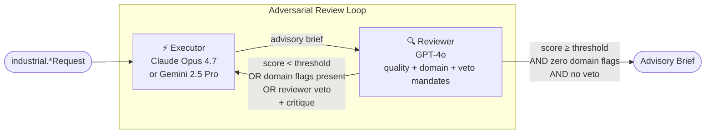

# Industrial Manufacturing & IoT — Executive Brief

**Date:** May 2026
**Author:** Giri Manchaiah
**Status:** Teaching / research demonstration · NOT FOR PRODUCTION DEPLOYMENT
**Based on:** Yang, R., Li, Y., & Li, S. (2026). *ARIS: Autonomous Research via Adversarial Multi-Agent Collaboration*. arXiv:2605.03042. [https://arxiv.org/abs/2605.03042](https://arxiv.org/abs/2605.03042) — Shanghai Jiao Tong University · Shanghai Innovation Institute

## What it is

Eight workflows in `adv_multi_agent.industrial` apply adversarial multi-agent collaboration to the recurring decisions an industrial-equipment OEM actually makes — sourcing, supplier qualification, engineering change, quality investigation, product-liability attribution, recall scope, supply-chain resilience, and telematics anomaly triage. Modelled on the Crown Equipment Corporation surface (vertically-integrated OEM with InfoLink telematics + DualMode automation + extended-lifecycle aftermarket), the recipe generalises to any discrete-manufacturing OEM that ships hardware on a subscription-data layer. Two AI models from different provider families produce and challenge each recommendation, iterating until the output meets a quality threshold *and* passes three domain-specific gates; the two highest-criticality workflows (product-liability root-cause + recall scope) additionally support a reviewer veto for catastrophic-injury / regulator-notification exposure. Every output is an advisory brief for a credentialed human — never an automated CAPA release, recall trigger, ECN release, supplier disqualification, or maintenance dispatch.

## The Problem

Industrial OEMs concentrate the four properties that make LLM error-modes uniquely costly: **irreversibility** (a $50M plant capex commit, a recall scope that includes every unit shipped that year, a functional-safety re-certification that takes months, a supplier disqualification that breaks the line, an ECO that breaks 50,000 field-installed units), **regulator audit-trail** (OSHA 1904 recordable logs, CPSC § 15(b) substantial-product-hazard reports, ANSI/ITSDF B56.x + ISO 3691-4 functional-safety, EPA emissions, FCPA / customs / export-control, SEC warranty-reserve disclosure), **asymmetric information** (the supplier knows their financial stress before the OEM; the customer knows duty-cycle abuse before the warranty claim; field service knows failure-mode patterns before reliability engineering), and **echo-chamber risk** (OEM engineering develops "we always do it this way" precedent-bias; same-family LLMs replicate it — particularly load-bearing on root-cause attribution and supplier-disqualification decisions). Single-model AI assistance carries compounding risks: operator-error attribution masks design-defect signal; "we have a second source" claims aren't actually dual-sourced at the sub-tier; recall scope is drawn narrow to minimise commercial impact; ECO field-implication scans miss firmware-compatibility regressions on the deployed-product population.

## The Approach

The same adversarial loop that improves research manuscripts is applied to industrial OEM decisions — with one critical addition per workflow: three mandatory domain gates, plus an optional reviewer veto for the irreversible-class decisions.

The reviewer operates under multiple independent mandates every round: a **quality audit** (grounding, coverage, methodology, actionability) and **domain audits** specific to the workflow (cost / capability / IP-leak, financial / quality / geo-concentration, supersession / FMEA-delta / regression, causal-chain / containment / systemic, design-defect / operator-error / warning-adequacy, trigger-evidence / fleet-scope / regulatory-notify, single-source / geo-concentration / lead-time-fragility, signal-evidence / false-positive-cost / actionability). All must clear before the loop converges. The **reviewer-veto** channel is used by 2 of 8 workflows where the cost of one more loop iteration before halting exceeds the cost of a false-positive halt: catastrophic-injury design-defect attribution and under-scoped recall with regulator clock running.

## What it Produces (8 MVP workflows)

| # | Workflow | Track | Gate | Outputs |
|---|---|---|---|---|
| 1 | `MakeVsBuyWorkflow` | Mfg Ops | `COST` + `CAPABILITY` + `IP-LEAK` FLAGS | Internal should-cost build-up, normalised external bid TCO, capability evidence audit, IP class + protection plan, recommendation (Make / Buy / Dual / Parallel-tool), sourcing-council checklist |
| 2 | `SupplierQualificationWorkflow` | Mfg Ops | `FINANCIAL` + `QUALITY` + `GEO-CONCENTRATION` FLAGS | Audited-statement / D&B / RapidRatings stress screen, certification + PPAP + SCAR audit, Tier-2 sub-tier map, sanctions + export-control screen, Qualified / Conditional / Not Qualified verdict, procurement checklist |
| 3 | `EngineeringChangeOrderWorkflow` | Mfg Ops | `SUPERSESSION` + `FMEA-DELTA` + `REGRESSION` FLAGS | F/F/F supersession analysis per affected P/N, PFMEA / DFMEA delta with S/O/D + RPN, regression-test matrix + field-trial plan, service-bulletin + parts-catalog update list, change-advisory-board checklist |
| 4 | `QualityIncidentRootCauseWorkflow` | Mfg Ops | `CAUSAL-CHAIN` + `CONTAINMENT` + `SYSTEMIC` FLAGS | 5-Why with evidence anchors + falsification tests, containment-scope matrix (WIP / FG / in-transit / DC / field) + sort-method capability, adjacent-product read-across, CAPA + PFMEA-update plan, quality-engineering checklist |
| 5 | `ProductLiabilityRootCauseWorkflow` | Safety / Recall | `DESIGN-DEFECT` + `OPERATOR-ERROR` + `WARNING-ADEQUACY` FLAGS + reviewer veto | Design vs operator vs warning attribution with telematics + video + field-failure-population evidence, standards comparison (ANSI/ITSDF B56.x / ISO 3691-x / OSHA 1910.178), CPSC § 15(b) decision-input, product-safety-committee checklist |
| 6 | `RecallScopeManufacturingWorkflow` | Safety / Recall | `TRIGGER-EVIDENCE` + `FLEET-SCOPE` + `REGULATORY-NOTIFY` FLAGS + reviewer veto | CPSC § 15(b) substantial-product-hazard tiering, serial / build-date / configuration scope, multi-jurisdiction notification matrix (CPSC / OSHA / EU GPSR / Canada CCPSA), service-bulletin + parts + service-network plan, recall coordinator + outside-counsel checklist |
| 7 | `SupplyChainResilienceWorkflow` | Strategic Capital | `SINGLE-SOURCE` + `GEO-CONCENTRATION` + `LEAD-TIME-FRAGILITY` FLAGS | Tier-1 vs Tier-2 dual-source audit (hidden single-source surfaced), geographic-cluster mapping with political + natural-hazard overlay, route-chokepoint exposure + buffer-policy implication, resilience-action plan with cost + timeline, supply-chain-council checklist |
| 8 | `TelematicsAnomalyTriageWorkflow` | Industrial IoT | `SIGNAL-EVIDENCE` + `FALSE-POSITIVE-COST` + `ACTIONABILITY` FLAGS | Anomaly characterisation (magnitude / duration / σ-from-baseline / detector confidence), false-positive-base-rate vs cost-of-inaction analysis, specific action (dispatch / notify / monitor / escalate) with parts + SLA + escalation threshold, service-engineering checklist |

Every workflow appends a programmatically injected disclaimer: *"This document does not constitute an authorised sourcing decision / qualification / ECN release / CAPA release / safety attribution / recall initiation / resilience-investment commit / maintenance dispatch. A credentialed human (sourcing council / procurement / change-advisory-board / quality engineering / product-safety committee / outside counsel / supply-chain council / service engineering) retains full decision-making authority."* The disclaimer cannot be suppressed by prompt content.

The MVP-8 is one cut of a 27-workflow catalog (6 tracks; design doc: `docs/superpowers/specs/2026-05-14-industrial-domain-design.md`). 19 workflows are deferred to Phase 2 with locked designs.

## What it Does Not Do

No workflow releases a CAPA, issues an ECN, initiates a recall, files a CPSC § 15(b) report or OSHA notification, awards a supplier contract, disqualifies a supplier, books a warranty reserve, dispatches a service technician, or integrates with PLM (Teamcenter / Windchill / Aras), ERP (SAP / Oracle EBS / IFS), MES, CMMS / FRACAS, telematics platforms (Crown InfoLink / Hyster Tracker / Linde connect:), OSHA recordables systems, CPSC databases, D&B / RapidRatings / Resilinc supplier-risk feeds, customs / trade-compliance systems, or standards libraries (ANSI / ITSDF / ISO / IEC). Inputs are caller-supplied free-text; the workflow is a reasoning scaffold, not a system of record.

## Key Design Properties

**Multi-gate convergence** — quality score threshold *and* three domain-flag gates. A high-scoring brief with unresolved flags does not converge.

**Reviewer-veto for irreversible decisions** — 2 of 8 workflows extend the gate with a veto channel: `ProductLiabilityRootCauseWorkflow` (operator-error attribution masks design-defect signal; catastrophic injury without CPSC SPH analysis) and `RecallScopeManufacturingWorkflow` (under-scoped fleet with CPSC clock running; adjacent products with shared component excluded). Audit-trail writes happen *before* the veto break — the human authority sees what was vetoed and why. Both share the hardened `extract_veto_directive` helper.

**Caller-supplied inputs** — every field is free-text in the per-workflow request dataclass. Every field is bounded at `_MAX_FIELD_CHARS = 1500` chars in `to_prompt_text`; the concatenated prompt is further bounded at 6000 chars via `sanitize_for_prompt()`.

**Claim ledger** — every factual assertion in every brief is registered, tracked, and queryable. Hard-capped at 200 claims per round to bound ledger growth.

**Flag re-injection bound** — `truncate_flag_display(flags)` caps the per-header re-injection at 16 entries with a single truncation-marker bullet. Metadata audit-trail keeps the full list; only the next-round prompt is truncated.

**Programmatic disclaimer + skill-template hardening** — disclaimer injected in code (not removable by prompt injection). Skill template inputs strip control chars + braces.

**Same infrastructure, different domain** — all 8 industrial workflows extend `BaseWorkflow` from `core/`. Shared helpers (`extract_flags`, `extract_veto_directive`, `truncate_flag_display`, `sanitize_for_prompt`, `_register_claims`) keep per-workflow code focused on domain logic. All security properties inherited.

## Status

| Property | Status |
|---|---|
| 8 MVP workflows (4 Mfg Ops + 2 Safety/Recall + 1 Strategic Capital + 1 Industrial IoT) | ✅ Complete |
| 19 Phase-2 workflows | 📋 Design-locked in `2026-05-14-industrial-domain-design.md` |
| 32 industrial skill templates (4 per MVP workflow) | ✅ Complete |
| Triple-flag gate pattern (8 of 8 MVP workflows) | ✅ Complete |
| Reviewer-veto pattern (2 of 8 MVP workflows) | ✅ Complete |
| Approver checklists per workflow | ✅ Complete |
| 8 industrial examples (`examples/industrial/*.py`) | ✅ Complete |
| 67 industrial unit tests (8 files) | ✅ All passing |
| **481 total tests** (research + parole + retail + pc + industrial + shared) | ✅ All passing |
| Design doc + D-IND-1 in `decisions.md` | ✅ Complete |
| Focused security audit (H-IND-1 + L-IND-1..5) | ✅ Complete |
| H-IND-1 + L-IND-1 closure (shared parser hyphen-sibling-stop fix) | ✅ Closed same-session |
| Live PLM / ERP / MES / CMMS / telematics-platform integration | ❌ PRODUCTION_GAP |
| Should-cost engine (activity-based costing) | ❌ PRODUCTION_GAP — caller-supplied prose |
| D&B / RapidRatings / Resilinc supplier-risk feed | ❌ PRODUCTION_GAP — caller-supplied prose |
| Standards library (ANSI / ITSDF B56.x / ISO 3691-x / OSHA 1910.178) | ❌ PRODUCTION_GAP — caller-supplied citation |
| Telematics platform integration (InfoLink / Hyster Tracker / Linde connect:) | ❌ PRODUCTION_GAP — caller-supplied prose |
| CPSC § 15(b) / OSHA / EU GPSR / CCPSA notification routing | ❌ PRODUCTION_GAP — flagged on checklist, not executed |
| Customs / export-control screening | ❌ PRODUCTION_GAP — flagged in IP-leak prompt only |
| Append-only audit store (CPSC / OSHA / discovery-defensible) | ❌ PRODUCTION_GAP — session-local JSON only |
| Dedicated third-model engineering / safety auditor cascade (ARIS §3.1) | ❌ PRODUCTION_GAP — single-stage reviewer folds quality + domain audit |
| Human approval gate enforced in code | ❌ PRODUCTION_GAP — CAPA / ECN / recall / dispatch must not auto-publish |

## Who It Is For

**Industrial OEM teams** evaluating LLM augmentation across the decision surface — sourcing, supplier qualification, ECO impact, quality investigation, product-liability attribution, recall scope, supply-chain resilience, telematics triage. The convergence gates + veto channel + ledger provide a structured audit trail; per-workflow `PRODUCTION_GAPS` lists name exactly what integration work is required before a pilot.

**Engineering teams** adding a new domain or scenario. Industrial is the fifth reference implementation (after research + parole + retail + pc) and the first to organise into six tracks with a 27-workflow design-locked catalog where the MVP is one explicit cut. The recipe is locked: per-workflow `*Request` dataclass with `_MAX_FIELD_CHARS` cap, three domain-flag gates, optional veto via shared `extract_veto_directive`, `extract_flags` + `_register_claims` + `truncate_flag_display` from shared helpers, `_DISCLAIMER` banner, approver checklist, skill templates with scenario-noun prefix.

**Researchers** studying how cross-model adversarial pairs reduce confident-but-wrong errors in operational decisions where ground truth is observable (CAPA effectiveness at follow-up, recall scope adequacy at completion-rate review, supplier-qualification outcome at SCAR history, ECO regression at field-emergence, telematics-triage actionability at dispatch outcome, supply-chain resilience at disruption event).

## Next Actions

| Action | Owner | Notes |
|---|---|---|
| Phase 2 workflow expansion (19 deferred designs) | Engineering | Pull from catalog in priority order — `FunctionalSafetyCaseWorkflow` (#10), `PredictiveMaintenanceRULWorkflow` (#18), `AutomationCommissioningWorkflow` (#24) most-likely first |
| PLM / ERP / MES / CMMS integration adapters | Engineering | Replace caller-supplied prose with structured records |
| Should-cost engine (ABC) integration | Finance + Engineering | LLM advises the deviation, not the base estimate |
| D&B / RapidRatings / Resilinc feed | Procurement + Engineering | Supplier-risk signals from structured feeds |
| Standards library + applicability engine | Product safety + Engineering | ANSI / ITSDF / ISO / IEC machine-readable corpus |
| Telematics platform integration | Service engineering + Engineering | Structured signal stream, not paraphrased prose |
| CPSC / OSHA / EU GPSR notification routing | Regulatory counsel + Engineering | Structured submission, not checklist line item |
| Dedicated third-model auditor cascade per veto-using workflow | Engineering | ARIS §3.1 — separately configured model for design-defect + recall-scope decisions |
| Tamper-evident audit store | Engineering + Compliance | CPSC / OSHA discovery-defensibility |
| Human approval gate enforced in code | Engineering | CAPA / ECN / recall / dispatch must not auto-publish |
| Pilot studies | Quality + Product Safety + Supply Chain + Service Engineering | Single facility, single product family, single decision class — 90-day shadow run per workflow before any production exposure |
