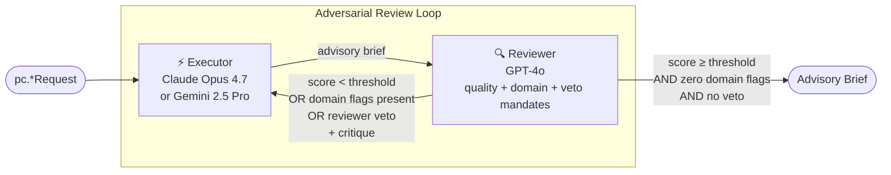

# Specialized B2B P&C Insurance — Executive Brief

**Date:** May 2026
**Author:** Giri Manchaiah
**Status:** Teaching / research demonstration · NOT FOR PRODUCTION DEPLOYMENT
**Based on:** Yang, R., Li, Y., & Li, S. (2026). *ARIS: Autonomous Research via Adversarial Multi-Agent Collaboration*. arXiv:2605.03042. [https://arxiv.org/abs/2605.03042](https://arxiv.org/abs/2605.03042) — Shanghai Jiao Tong University · Shanghai Innovation Institute

## What it is

Seven workflows in `adv_multi_agent.pc` apply adversarial multi-agent collaboration to the recurring decisions a P&C claims adjuster, coverage counsel, underwriter, or cyber-risk underwriter actually makes — in both **Foundational** (mainstream commercial) and **Specialty** (niche commercial: environmental, agricultural, gig-economy) tracks. Two AI models from different provider families produce and challenge each recommendation, iterating until the output meets a quality threshold *and* passes one to three domain-specific gates; the four highest-criticality workflows additionally support a reviewer veto for SOX-restatement, bad-faith, prior-knowledge, or worker-misclassification exposure. Every output is an advisory brief for a credentialed human — never an automated reserve booking, denial, or bind.

## The Problem

Specialized commercial P&C concentrates three properties that make LLM error-modes uniquely costly: **irreversibility** (a booked reserve, denied claim, or bound policy crystallises an $-figure or coverage decision that can only be revised at cost), **regulator audit-trail** (NAIC market-conduct exams, SOX reserve-adequacy reviews, state DOI rate filings, EPA / CERCLA enforcement, state AG worker-classification audits all leave durable records), and **asymmetric information** (the insured knows their site history, control maturity, or worker-classification posture better than the underwriter; the claimant knows the actual scope of loss better than the adjuster). Single-model AI assistance carries compounding risks: precedent-bias drives reserves to the comparable-case median when the venue is plaintiff-friendly; quoted policy wording paraphrases the controlling clause and creates bad-faith exposure on denial; class-specific exclusions are missing for hot-work / hazardous-class binds; cyber sub-limits are sized to attested controls rather than evidence-supported controls; parametric crop triggers measure rainfall when the producer's loss is heat stress; gig-platform binds survive the worker-classification audit only by accident.

## The Approach

The same adversarial loop that improves research manuscripts is applied to specialized commercial P&C — with one critical addition per workflow: one to three mandatory domain gates, plus an optional reviewer veto for the irreversible-class decisions.

The reviewer operates under multiple independent mandates every round: a **quality audit** (grounding, coverage, methodology, actionability) and **domain audits** specific to the workflow (reserve adequacy, wording fidelity, loss-cost defensibility, control-evidence correlation, known-condition mapping, peril-match, classification posture). All must clear before the loop converges. Two patterns layer on top: a **reviewer-veto** (used by 4 of the 7 workflows) lets the reviewer halt the loop on a SOX-restatement / bad-faith / prior-knowledge / misclassification-audit signal regardless of score, and a **triple-flag gate** (used by 5 of the 7 workflows) requires three independent flag classes to all be empty before convergence.

## What it Produces

| Workflow | Track | Gate | Outputs |
|---|---|---|---|
| `ClaimsReserveWorkflow` | Foundational | `RESERVE` + `PRECEDENT` + `LITIGATION` FLAGS + reviewer veto | Indemnity + defence-cost reserve $, IBNR uplift basis, venue/posture adjustment math, regulatory aggregate provision, reinsurer notification check, claims-committee checklist |
| `CoverageDecisionWorkflow` | Foundational | `WORDING` + `CASE-LAW` FLAGS + reviewer veto | Verbatim controlling clause, fact-by-fact dispute analysis, in-jurisdiction case-law support, bad-faith screen, next-actions (ROR / denial / coverage-counsel referral), coverage-counsel checklist |
| `CommercialUnderwritingWorkflow` | Foundational | `LOSS-COST` + `EXCLUSION` + `CAPACITY` FLAGS | Premium math (ISO loss-cost × LCM ± filed deviation), class-specific exclusion schedule, capacity check (LOB aggregate + treaty + cat-zone), authority-matrix routing, senior-underwriter checklist |
| `CyberUnderwritingWorkflow` | Foundational | `CONTROL-GAP` + `SUB-LIMIT` + `AGGREGATION` FLAGS | Control attestation-vs-evidence audit, per-coverage sub-limit calibration, portfolio concentration check (industry / cloud-provider / common-vendor), war/cyber-terrorism exclusion verification, IR vendor panel, cyber-underwriter checklist |
| `EnvironmentalImpairmentWorkflow` | Specialty | `KNOWN-CONDITION` + `TAIL` + `REGULATORY-OVERLAP` FLAGS + reviewer veto | Phase I/II ESA → known-condition clause mapping, trigger doctrine + policy-period attribution, EPA / CERCLA / state DEP overlay, long-tail reserve components, NRD trustee identification, environmental-counsel checklist |
| `ParametricCropWorkflow` | Specialty | `PERIL-MATCH` + `BASIS` + `ATTACHMENT` FLAGS | Trigger-vs-loss-pathway correlation, basis-risk quantification (spatial + statistical), 20-yr climate baseline back-test with trend treatment, RMA / commercial-retro placement, plain-language producer disclosure, ag-underwriter checklist |
| `GigPlatformLiabilityWorkflow` | Specialty | `CLASSIFICATION` + `COVERAGE-GAP` + `REGULATORY-PATCHWORK` FLAGS + reviewer veto | State-by-state classification posture (AB5 / IRS 20-factor / state TNC), platform-on/off coverage seam map, multi-state regulatory audit, retroactive-reclassification rider check, telemetry-evidence defensibility, platform-liability-counsel checklist |

Every workflow appends a programmatically injected disclaimer: *"This document does not constitute an authorised reserve booking / coverage decision / bind / policy issuance. A credentialed human (actuary / coverage counsel / underwriter) retains full decision-making authority."* The disclaimer cannot be suppressed by prompt content.

## What it Does Not Do

No workflow books a reserve to Schedule P, issues a denial / partial / ROR letter, binds coverage, files a state rate-adequacy filing, notifies a reinsurer, executes a regulator notification, or integrates with claims platforms (Guidewire ClaimCenter, Origami), policy admin systems (PolicyCenter, mainframe), ISO/Verisk loss-cost tables, NAIC Schedule P feeds, USDA-RMA / SRA systems, EPA ECHO / state DEP databases, or state DOL audit feeds. Inputs are caller-supplied free-text; the workflow is a reasoning scaffold, not a system of record.

## Key Design Properties

**Multi-gate convergence** — quality score threshold *and* two to three domain-flag gates. A high-scoring brief with unresolved flags does not converge.

**Reviewer-veto for irreversible decisions** — 4 of 7 workflows extend the gate with a veto channel: `ClaimsReserveWorkflow` (catastrophic-injury under-reserve / class-action without aggregate / state AG without regulatory-defence reserve), `CoverageDecisionWorkflow` (proposed denial with reasonable-coverage interpretation / bad-faith pattern), `EnvironmentalImpairmentWorkflow` (prior-knowledge / known-condition on PLL), `GigPlatformLiabilityWorkflow` (bind survives classification audit by accident / unpriced retroactive-reclass exposure). Audit-trail writes happen *before* the veto break — the human authority sees what was vetoed and why. All 4 share the hardened `extract_veto_directive` helper in `core/_internal.py` (line-anchored marker regex, M2 continuation handling, L5 sibling-header rule).

**Caller-supplied inputs** — site history, comparable cases, policy wording, control attestations, regulator filings, climate baselines, classification posture, telemetry capabilities are all free-text in the per-workflow request dataclass. Every field is bounded at `_MAX_FIELD_CHARS = 1500` chars in `to_prompt_text`; the concatenated prompt is further bounded at 6000 chars via `sanitize_for_prompt()`. List fields are not used in P&C requests.

**Claim ledger** — every factual assertion in every brief is registered, tracked, and queryable. Hard-capped at 200 claims per round to bound ledger growth.

**Flag re-injection bound** — `truncate_flag_display(flags)` caps the per-header re-injection at 16 entries with a single truncation-marker bullet. Metadata audit-trail keeps the full list; only the next-round prompt is truncated.

**Programmatic disclaimer + skill-template hardening** — disclaimer injected in code (not removable by prompt injection). Skill template inputs strip control chars + braces (the latter closes a format-syntax smuggling vector identified in the 2026-05-14 audit).

**Same infrastructure, different domain** — all 7 workflows extend `BaseWorkflow` from `core/`. Helper extraction (`core._internal.extract_flags`, `extract_veto_directive`, `truncate_flag_display`, `BaseWorkflow._register_claims`) keeps the per-workflow code focused on domain logic. All security properties (key redaction, path sandboxing, atomic writes, injection controls) are inherited.

## Status

| Property | Status |
|---|---|
| 4 Foundational + 3 Specialty workflows | ✅ Complete |
| 29 P&C skill templates (5 reserve + 4 coverage + 4 underwriting + 4 cyber + 4 environmental + 4 crop + 4 gig) | ✅ Complete |
| Triple-flag gate pattern (5 of 7 workflows) | ✅ Complete |
| Reviewer-veto pattern (4 of 7 workflows) | ✅ Complete |
| Approver checklists per workflow | ✅ Complete |
| 7 P&C examples (`examples/pc/*.py`) | ✅ Complete |
| 409 unit + integration tests | ✅ All passing |
| Design doc + locked decisions (`docs/superpowers/specs/2026-05-14-pc-domain-design.md`, D-PC-1..6 in `decisions.md`) | ✅ Complete |
| Post-sweep security audit (M-PC-1 + L-PC-1..5 all closed) | ✅ Complete |
| Live ClaimCenter / PolicyCenter / Origami / AS400 / mainframe integration | ❌ PRODUCTION_GAP |
| Loss-development triangles (chain-ladder / Bornhuetter-Ferguson) | ❌ PRODUCTION_GAP — LLM advises the residual, not the base estimate |
| ISO/Verisk loss-cost tables + filed rate library | ❌ PRODUCTION_GAP — caller-supplied premium / LCM only |
| NAIC Schedule P + state DOI filing feeds | ❌ PRODUCTION_GAP — quarterly/annual reporting handled outside this scope |
| USDA-RMA Crop Insurance Handbook + SRA program rules | ❌ PRODUCTION_GAP — federal program terms are not embedded |
| Authoritative weather-data feed (NOAA station archives, gridded products) | ❌ PRODUCTION_GAP — caller-supplied prose |
| EPA ECHO / RCRAInfo / NPL / state DEP feeds + Phase I/II ESA parser | ❌ PRODUCTION_GAP — caller-supplied prose |
| Westlaw / Lexis Shepard's case-law retrieval | ❌ PRODUCTION_GAP — citations not Shepardized at runtime |
| State-by-state classification rule engine (AB5 / Prop 22 / state TNC) | ❌ PRODUCTION_GAP — caller-supplied prose |
| Platform-app telemetry integration | ❌ PRODUCTION_GAP — claim-period determination requires authoritative timestamps |
| Live portfolio aggregation engine | ❌ PRODUCTION_GAP — concentration % is caller-supplied |
| Reinsurer notification routing (treaty thresholds) | ❌ PRODUCTION_GAP — flagged on checklist, not executed |
| Append-only audit store (tamper-evident, regulator-defensible) | ❌ PRODUCTION_GAP — session-local JSON only |
| Dedicated third-model actuarial / coverage / cyber auditor cascade (ARIS §3.1) | ❌ PRODUCTION_GAP — single-stage reviewer folds quality + domain audit; production needs a separately configured auditor model per high-stakes flag class |
| Human approval gate enforced in code | ❌ PRODUCTION_GAP — reserves, denials, binds, regulator notices must not auto-publish |

## Who It Is For

**P&C claims, coverage, underwriting, and cyber teams** evaluating LLM augmentation across the decision surface — reserve adequacy, coverage / bad-faith decisions, complex commercial underwriting, cyber risk, environmental impairment, parametric crop, gig-platform liability. The convergence gates + veto channel + ledger provide a structured audit trail; the per-workflow `PRODUCTION_GAPS` checklist names exactly what integration work is required before a pilot.

**Engineering teams** adding a new domain or scenario to the adversarial multi-agent library. The P&C domain is the third reference implementation after parole and retail, and the first to organise into Foundational + Specialty tracks. The recipe is locked: per-workflow `*Request` dataclass with `_MAX_FIELD_CHARS` cap, two to three domain-flag gates, optional veto via shared `extract_veto_directive`, `extract_flags` + `_register_claims` + `truncate_flag_display` from shared helpers, `_DISCLAIMER` banner, approver checklist, skill templates with a scenario-noun prefix.

**Researchers** studying how cross-model adversarial pairs reduce confident-but-wrong errors in operational decisions where ground truth is observable (reserve adequacy at claim closure, coverage decisions at settlement / verdict, bind outcomes at renewal / claim emergence, cyber bind outcomes at incident emergence, environmental reserves at Schedule-P review, parametric trigger performance at season-end, gig-platform classification at audit outcome).

## Next Actions

| Action | Owner | Notes |
|---|---|---|
| ClaimCenter / PolicyCenter / Origami / mainframe integration adapters | Engineering | Replace free-text claim / policy / loss-history inputs with structured extracts |
| Loss-development triangles + actuarial baseline | Actuarial + Data Science | LLM provides residual adjustments and decision context, not the base estimate |
| ISO/Verisk loss-cost + filed-rate library | Underwriting + Engineering | Per-state filed-deviation availability; manual is the source of truth |
| USDA-RMA program-rule engine | Agricultural Underwriting + Engineering | Crop Insurance Handbook + state/county SRA group + Special Provisions |
| EPA / state-DEP / Westlaw / state-DOL feed integration | Environmental + Coverage + Platform Counsel + Engineering | Structured retrieval against authoritative databases |
| State-by-state classification rule engine | Platform-Liability Counsel + Engineering | AB5 / Prop 22 / state TNC / NLRB joint-employer rule base |
| Dedicated third-model auditor cascade per high-stakes flag class | Engineering | ARIS §3.1 — separately configured model for veto-using workflows |
| Tamper-evident audit store | Engineering + Compliance | NAIC market-conduct + SOX reserve-adequacy + EPA / state-DEP audit defensibility |
| Human approval gate enforced in code | Engineering | Reserves / denials / binds / regulator notices must not auto-publish |
| Pilot studies | Claims + Coverage + Underwriting | Single LOB, single state, single claim/account class — 90-day shadow run per workflow before any production exposure |
